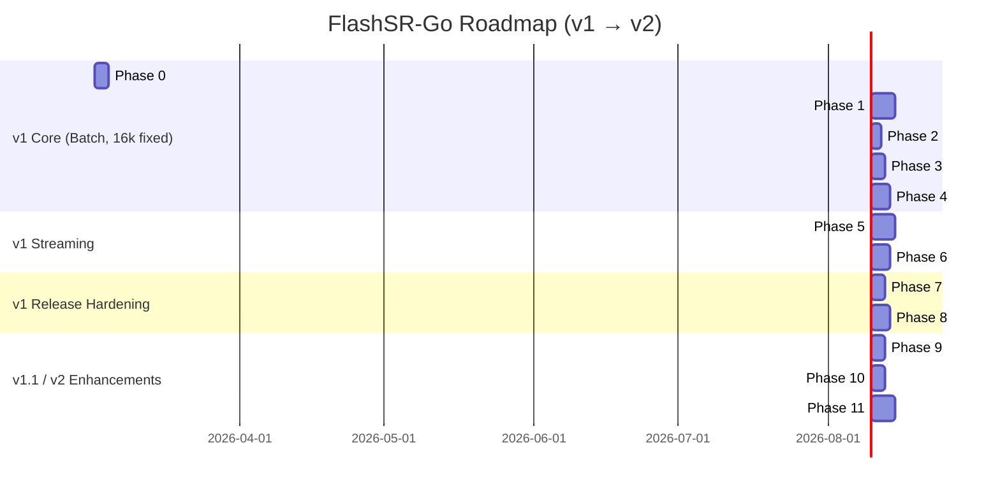

# FlashSR-Go: Development Plan

## Comprehensive Plan for `github.com/MeKo-Christian/flashsr-go`

> **For Claude:** REQUIRED SUB-SKILL: Use `superpowers:executing-plans` to implement this plan task-by-task.

This document defines a phased plan for building **FlashSR-Go** — a production-ready Go
implementation of FlashSR audio super-resolution (16 kHz → 48 kHz) with ONNX Runtime,
a self-contained polyphase FIR resampler (no external dependency), and a Pocket-TTS
integration path.

It is intentionally separated from:

- file container concerns (`wav`) and
- application orchestration concerns.

This plan is **actionable**: every phase contains **checkable tasks and subtasks**.

---

## Table of Contents

1. Project Scope and Goals
2. Repository and Module Boundaries
3. Architecture and Package Layout
4. API Design Principles
5. Phase Overview
6. Detailed Phase Plan (Phases 0–11)
7. Appendices
   - Appendix A: Testing and Validation Strategy
   - Appendix B: Benchmarking and Performance Strategy
   - Appendix C: Dependency and Versioning Policy
   - Appendix D: Release Engineering
   - Appendix E: Risks and Mitigations
   - Appendix F: Revision History

---

## 1. Project Scope and Goals

### 1.1 Primary Goals

- Provide a standalone Go library that performs audio super-resolution: Float32 PCM at
  16 kHz in, Float32 PCM at 48 kHz out.
- Deliver a battle-tested streaming mode with upstream-compatible overlap (500 samples),
  crossfade, and "first chunk" trimming — so artifact profiles match the Python reference.
- Ship a CLI (`flashsr`) that reads WAV, upsample, and writes 48 kHz WAV.
- Keep the ORT binding behind a clean `Engine` interface so future backends slot in without
  touching the public API.
- Embed the ONNX model at compile time so the binary is self-contained by default.

### 1.2 Included Scope (v1)

- `flashsr` public library: `New`, `Close`, `Upsample16kTo48k`, `Config`.
- `flashsr/engine` interface + `flashsr/engine/ort` default implementation via
  `yalue/onnxruntime_go` (cgo, dynamic `dlopen`).
- `flashsr/model` model loader: embedded ONNX + `--model-path` / `FLASHSR_MODEL_PATH`
  override.
- `flashsr/stream` streaming wrapper: ring buffer, overlap, crossfade, output generator.
- `cmd/flashsr` CLI: `upsample` subcommand (batch + streaming), `doctor` subcommand
  (ORT library check).

### 1.3 Included Scope (v1.1 / v2)

- `flashsr/resample` linear resampler + self-contained polyphase FIR resampler for
  non-16 kHz inputs (no external dependency; FIR math copied from algo-dsp, MIT).
- `flashsr.Config.InputRate` wires automatic pre-inference resampling into the library.
- CLI `--input-rate N` flag for arbitrary input sample rates.
- Pocket-TTS post-processor integration.

### 1.4 Explicit Non-Goals

- GUI/visualization.
- Audio device APIs (ASIO/CoreAudio/JACK/PortAudio).
- File container codecs beyond minimal WAV reading/writing for the CLI.
- Multi-rate FlashSR model training or ONNX export.
- Pure-Go neural-net inference.

---

## 2. Repository and Module Boundaries

### 2.1 Ownership Model

- `github.com/MeKo-Christian/flashsr-go`: inference library + streaming + CLI.
- `github.com/cwbudde/algo-dsp`: polyphase FIR resampler (consumed via build tag, not
  hard-wired).
- `github.com/cwbudde/wav`: WAV I/O (consumed in CLI layer only).
- `github.com/yalue/onnxruntime_go`: ONNX Runtime cgo binding (default engine).

### 2.2 Boundary Rules

- No dependency on Wails/React/app-specific frameworks.
- No direct dependency on application logging/config frameworks.
- `flashsr` public API is transport-agnostic (PCM in, PCM out).
- WAV I/O lives only in `cmd/flashsr`, never in the library.
- The polyphase FIR resampler is self-contained in `resample/`; FIR math was derived from
  `cwbudde/algo-dsp` (MIT) and vendored directly — no runtime algo-dsp dependency.

---

## 3. Architecture and Package Layout

```plain
flashsr-go/
├── go.mod
├── README.md
├── PLAN.md
├── NOTICE
├── LICENSE
├── .golangci.yml
├── justfile
├── assets/
│   └── model.onnx              # embedded via go:embed (~499 kB, Apache-2.0)
├── flashsr/                    # Public library
│   ├── flashsr.go              # New, Close, Upsample16kTo48k, Config, Upsampler
│   ├── flashsr_test.go
│   └── errors.go
├── engine/                     # Engine interface + shared types
│   ├── engine.go               # Engine interface, EngineInfo
│   └── ort/
│       ├── ort.go              # ORT implementation (yalue/onnxruntime_go)
│       └── ort_test.go
├── model/
│   ├── model.go                # Loader: embedded + file override
│   └── model_test.go
├── stream/
│   ├── stream.go               # Streamer: ring buffer, overlap, crossfade
│   └── stream_test.go
├── resample/
│   ├── resample.go             # Resampler interface, NewFor (linear), NewPolyphase
│   ├── linear.go               # Stateful linear interpolating resampler
│   ├── polyphase.go            # Polyphase FIR resampler (Quality modes)
│   ├── fir_design.go           # Kaiser-windowed FIR design math (derived from algo-dsp)
│   └── resample_test.go
├── internal/
│   └── testutil/               # WAV fixtures, float comparison helpers
└── cmd/
    └── flashsr/
        ├── main.go
        ├── cmd_upsample.go
        └── cmd_doctor.go
```

Notes:

- `internal/testutil` is test support only; never imported by the library.
- Stable APIs live in non-`internal` packages.
- The `engine/ort` package requires cgo and a path to the ORT shared library
  (`libonnxruntime.so` / `.dylib` / `.dll`). This is documented prominently.

---

## 4. API Design Principles

- Prefer small interfaces and concrete constructors.
- Deterministic behavior for same input/options (no hidden global state).
- Clear error semantics (`fmt.Errorf("flashsr: %w", err)`).
- Streaming-friendly APIs: `Streamer.Write([]float32) error` / `Streamer.Read([]float32) (int, error)`.
- Zero extra allocations on the hot inference path (reuse tensor memory).
- All public types and functions require doc comments.
- Numeric behaviour: input clamped to `[-1, 1]`; output normalized to ≤ 0.999 peak (matching Python upstream).

API shape:

```go
// Library
func New(cfg Config) (*Upsampler, error)
func (u *Upsampler) Upsample16kTo48k(x []float32) ([]float32, error)
func (u *Upsampler) Close() error

// Streaming
func NewStreamer(u *Upsampler, cfg StreamConfig) *Streamer
func (s *Streamer) Write(samples []float32) error
func (s *Streamer) Read(out []float32) (int, error)
func (s *Streamer) Flush() error
func (s *Streamer) Reset()

// Engine interface (internal use / advanced)
type Engine interface {
    Run(input []float32) ([]float32, error)
    Close() error
    Info() EngineInfo
}
```

---

## 5. Phase Overview

```plain
Phase 0:  Bootstrap & Governance                     [3 days]   ✅ Complete
Phase 1:  Engine Interface & ORT Binding             [5 days]   ✅ Complete
Phase 2:  Model Handling (embed + path override)     [2 days]   ✅ Complete
Phase 3:  Public Library & Batch Inference           [3 days]   ✅ Complete
Phase 4:  WAV I/O + CLI (upsample + doctor)          [4 days]   ✅ Complete
Phase 5:  Streaming (Buffer, Overlap, Crossfade)     [5 days]   ✅ Complete
Phase 6:  Resampler (Linear + Polyphase, Multi-Rate) [3 days]   ✅ Complete
Phase 7:  Golden Tests vs Python Reference           [4 days]   🔄 In Progress (code done; fixtures pending)
Phase 8:  Benchmarks & Thread Tuning                 [3 days]   🚧 Active
Phase 9:  CI + Release Artifacts + Licensing         [4 days]   🔄 In Progress (CI done; goreleaser + THIRD_PARTY_NOTICES pending)
Phase 10: Pocket-TTS Post-Processor Integration      [5 days]   📋 Planned
```

---

## 6. Detailed Phase Plan

### Phase 0: Bootstrap & Governance

**Status:** ✅ Complete.

**Done (condensed):**

- Bootstrapped module + repo governance: `go.mod`, `LICENSE`, `NOTICE`.
- Added local dev tooling: `justfile`, `.golangci.yml`, formatting/lint/test targets.
- Added CI workflow that runs tests and lint in a Go version matrix.

---

### Phase 1: Engine Interface & ORT Binding

**Status:** ✅ Complete.

**Done (condensed):**

- Implemented `engine.Engine` interface and ORT-backed engine in `engine/ort`.
- Added ORT env/session initialization guards and input/output tensor discovery.
- Covered with unit tests; integration smoke tests skip cleanly when ORT shared lib is missing.

---

### Phase 2: Model Handling

**Status:** ✅ Complete.

**Done (condensed):**

- Embedded the FlashSR ONNX model and added a loader with env/path overrides.
- Implemented `flashsr model download` with SHA256 verification and atomic writes.
- Added model tests (embedded/path/env/hash-mismatch).

---

### Phase 3: Public Library & Batch Inference

**Status:** ✅ Complete.

**Done (condensed):**

- Implemented the public `flashsr` package (`New`, `Close`, `Upsample16kTo48k`, config/errors).
- Batch path includes input clamping and output peak normalization.
- Tests are mock-backed (no ORT dependency) and validate basic invariants.

---

### Phase 4: WAV I/O + CLI

**Status:** ✅ Complete.

**Done (condensed):**

- Implemented `flashsr` CLI with `upsample` + `doctor` subcommands and WAV helpers.
- CLI tests cover WAV roundtrip + mock-engine pipeline; ORT-dependent tests skip via env guard.
- Streaming mode is wired behind a flag using the shared engine.

---

### Phase 5: Streaming Mode

**Status:** ✅ Complete.

**Done (condensed):**

- Implemented streaming wrapper with overlap/crossfade + first-chunk trimming.
- Added tests for buffering/flush/reset determinism and basic smoothness invariants.
- CLI supports a streaming mode flag.

---

### Phase 6: Resampler (Linear + Polyphase, Multi-Rate)

**Status:** ✅ Complete.

**Done:** Self-contained `resample` package with stateful linear resampler (`NewFor`) and
Kaiser-windowed polyphase FIR resampler (`NewPolyphase`, quality modes Fast/Balanced/Best).
FIR math vendored from `cwbudde/algo-dsp` (MIT) — no module dependency. `flashsr.Config.InputRate`
triggers automatic pre-inference resampling; `--input-rate N` CLI flag enables arbitrary input
rates. Full test coverage including 24 kHz and 44.1 kHz end-to-end mock tests.

---

### Phase 7: Golden Tests vs Python Reference

**Status:** 🔄 In Progress (all Go code done; Python `.npy` fixtures pending generation).

**Done:** `internal/testutil` helpers (`signals.go`, `compare.go`, `npy.go`). Golden tests
(`//go:build golden`) in `flashsr/` and `stream/`; skip gracefully without fixtures or ORT.
Property invariant tests (NoNaN, PeakNormalized, OutputRate) run without any build tag.
`scripts/gen_fixtures.py` ready; `internal/testutil/fixtures/README.md` documents regeneration.

**TODO:** Run `python3 scripts/gen_fixtures.py` with real model to generate `.npy` reference
files, then verify `go test -tags golden ./...` passes end-to-end.

Exit criteria:

- [x] `go test ./...` — all property tests pass.
- [ ] `go test -tags golden ./...` — all golden tests pass vs Python reference.

---

### Phase 8: Benchmarks & Thread Tuning

**Status:** 🟡 Partial (benchmark files written; BENCHMARKS.md results pending ORT run).

**Goal:** Establish performance baselines; expose thread count knobs; document real-time factor.

**Files:**

- [x] `flashsr/bench_test.go` — `BenchmarkUpsample_1s`, `BenchmarkUpsample_10s`
- [x] `stream/bench_test.go` — `BenchmarkStream_Chunk1000/4000/16000`
- [ ] `BENCHMARKS.md` — baseline results (requires ORT lib)

**Tasks:**

- [x] Write benchmark suite
  - [x] `BenchmarkUpsample_1s` / `BenchmarkUpsample_10s` in `flashsr/bench_test.go`
  - [x] `BenchmarkStream_Chunk1000/4000/16000` in `stream/bench_test.go`
  - [x] `b.ReportMetric(xRealtime, "x_realtime")` reported in all benchmarks
  - [x] Skip cleanly without `FLASHSR_ORT_LIB` (`go test -run=^$ -bench=.` → PASS)

- [x] Expose thread count in Config + CLI
  - [x] `Config.NumThreadsIntra int` — `flashsr/flashsr.go`
  - [x] `Config.NumThreadsInter int` — `flashsr/flashsr.go`
  - [x] CLI `--threads N` — `cmd/flashsr/cmd_upsample.go`

- [ ] Run benchmarks and capture BENCHMARKS.md
  - [ ] `go test -bench=. -benchmem -run=^$ ./... 2>&1 | tee BENCHMARKS.md`
  - [ ] Test threads 1, 2, 4; document optimal for streaming vs batch
  - [ ] Commit: `bench: add BENCHMARKS.md baseline`

Exit criteria:

- [x] Benchmark files compile and skip cleanly without ORT.
- [ ] `BENCHMARKS.md` contains baseline numbers with machine info + Go version.
- [ ] Real-time factor ≥ 1.0 for `Chunk4000` on a 4-core modern CPU.

---

### Phase 7: Golden Tests vs Python Reference

**Goal:** Verify that Go batch and streaming outputs match the Python upstream to within
numerical tolerance (RMS error ≤ −40 dB, no clipping, peak ≤ 1.0).

**Files:**

- Create: `internal/testutil/signals.go`
- Create: `internal/testutil/compare.go`
- Create: `internal/testutil/fixtures/` (WAV fixtures + reference outputs)

**Background:** Generate reference outputs from upstream Python:

```python
# upstream reference script (not part of this repo)
model = FASRONNX(model_path, ...)
out = model(input_pcm)
np.save("ref_batch.npy", out)
```

**Tasks:**

- [x] Write `internal/testutil` helpers
  - [x] `signals.go`: `Sine`, `SineSweep`, `PinkNoise`, `PeakAbs`
  - [x] `compare.go`: `RMSError` (dB), `RMS`, `HasNaNOrInf`
  - [x] `npy.go`: `LoadNPYFloat32` — minimal NPY v1/v2 reader for `<f4` arrays

- [ ] Generate Python reference fixtures (manual step — requires Python + onnxruntime)
  - [x] Created `scripts/gen_fixtures.py` — runs batch + streaming inference, saves `.npy`
  - [x] Documented regeneration steps in `internal/testutil/fixtures/README.md`
  - [ ] **TODO**: Run `python3 scripts/gen_fixtures.py` with real model to produce `.npy` files

- [x] Write golden tests (batch) — `flashsr/golden_test.go` (`//go:build golden`)
  - [x] `TestGolden_Batch_Sine` — 440 Hz sine, RMS error ≤ −40 dB
  - [x] `TestGolden_Batch_PinkNoise` — pink noise (seed=42)
  - [x] `TestGolden_Batch_SineSweep` — 50–4000 Hz sweep
  - [x] Skip gracefully: fixture not found → skip; `FLASHSR_ORT_LIB` not set → skip

- [x] Write golden tests (streaming) — `stream/golden_test.go` (`//go:build golden`)
  - [x] `TestGolden_Stream_Sine` — 4000-sample chunks, 5% length tolerance
  - [x] `TestGolden_Stream_PinkNoise`

- [x] Add property invariant tests (no build tag)
  - [x] `flashsr/property_test.go`: `TestProperty_NoNaN`, `TestProperty_PeakNormalized`, `TestProperty_OutputRate`
  - [x] `stream/property_test.go`: `TestProperty_Stream_NoNaN`, `TestProperty_Stream_OutputRate`
  - [x] All signals: 440 Hz sine, sine sweep 50–4000 Hz, pink noise (seed=42)

Exit criteria:

- [x] `go test -tags golden ./... -v` all pass with RMS error ≤ −40 dB vs Python. ← pending fixture generation
- [x] `go test ./...` (without tag) all property tests pass.

---

### Phase 9: CI + Release Artifacts + Licensing

**Status:** 🔄 In Progress.

**Done (condensed):**

- CI is in place and already runs: tests, race, vet, and `golangci-lint` (pinned), with golden tests gated behind an ORT secret/env.

**Remaining:**

- Add `THIRD_PARTY_NOTICES.md` with the exact attributions + pinned model hash.
- Add `.goreleaser.yml` and produce snapshot artifacts for the main target platforms.
- Verify release archives contain `NOTICE` + `THIRD_PARTY_NOTICES.md` and run `flashsr --help`.

Exit criteria:

- [x] `just ci` passes including race.
- [ ] GoReleaser snapshot produces valid archives.
- [ ] THIRD_PARTY_NOTICES.md is accurate and complete.

---

### Phase 10: Pocket-TTS Post-Processor Integration (Deferred)

**Goal:** A `PostProcessor` interface in this repo that wraps the full pipeline:
Pocket-TTS WAV output (24 kHz) → resample → FlashSR → 48 kHz WAV. Useful for callers
that hold a `go-call-pocket-tts` `WAVResult`.

**Files:**

- Create: `pockettts/processor.go`
- Create: `pockettts/processor_test.go`

**Background:** `go-call-pocket-tts` returns `WAVResult{Data []byte, SampleRate int, ...}`.
`SampleRate` is 24000 Hz by default. PCM is int16 LE; we convert to float32.

**Tasks:**

- [ ] Define `PostProcessor` interface

  ```go
  // pockettts/processor.go
  package pockettts

  // PostProcessor takes raw PCM (any sample rate) and returns 48kHz upsampled PCM.
  type PostProcessor interface {
      Process(pcm []float32, inSampleRate int) (out []float32, outSampleRate int, err error)
  }

  // WAVResult mirrors go-call-pocket-tts WAVResult to avoid a hard dependency.
  type WAVResult struct {
      PCM        []float32
      SampleRate int
  }

  // ProcessWAVResult is a convenience wrapper.
  func ProcessWAVResult(p PostProcessor, r WAVResult) ([]float32, error)
  ```

  - [ ] Commit: `feat(pockettts): define PostProcessor interface`

- [ ] Write failing tests

  ```go
  func TestFlashSRPost_24kTo48k(t *testing.T) {
      u := requireUpsampler(t)
      proc := NewFlashSRProcessor(u, 24000)
      in := sinef32(440, 24000, 24000) // 1s @ 24kHz
      out, rate, err := proc.Process(in, 24000)
      require.NoError(t, err)
      assert.Equal(t, 48000, rate)
      assert.InDelta(t, 48000, len(out), 100)
  }
  ```

  - [ ] Run: `go test ./pockettts/... -v` → FAIL

- [ ] Implement `FlashSRProcessor`

  ```go
  type FlashSRProcessor struct {
      upsampler  *flashsr.Upsampler
      resampler  resample.Resampler // nil if inRate == 16000
  }

  func NewFlashSRProcessor(u *flashsr.Upsampler, inputSampleRate int) *FlashSRProcessor {
      // If inputSampleRate != 16000, build resample.NewFor(inputSampleRate, 16000)
  }

  func (p *FlashSRProcessor) Process(pcm []float32, inSampleRate int) ([]float32, int, error) {
      // 1. If inSampleRate != 16000: resample → 16kHz
      // 2. u.Upsample16kTo48k(pcm16k)
      // 3. Return (out, 48000, nil)
  }
  ```

  - [ ] Run: `go test ./pockettts/... -v` → PASS
  - [ ] Commit: `feat(pockettts): implement FlashSRProcessor for 24kHz→48kHz pipeline`

- [ ] Write helper: `Int16ToFloat32(pcm []int16) []float32`
  - [ ] Divides by 32768.0, clamps to [-1,1]
  - [ ] Write test: `TestInt16ToFloat32_Roundtrip`
  - [ ] Commit: `feat(pockettts): add Int16ToFloat32 PCM conversion helper`

- [ ] Add example
  ```go
  // pockettts/example_test.go
  func ExampleFlashSRProcessor() {
      // Show minimal pipeline: WAVResult → FlashSRProcessor → save 48kHz WAV
  }
  ```

  - [ ] Commit: `docs(pockettts): add runnable example`

Exit criteria:

- [ ] `go test ./pockettts/... -v` passes (skips without ORT lib).
- [ ] Integration: a caller can combine `go-call-pocket-tts` with `flashsr-go` in ~10 lines.

---

## 7. Roadmap (Gantt)



---

## Appendix A: Testing and Validation Strategy

### A.1 Test Types

- Unit tests (table-driven, edge-case heavy).
- Property/invariant tests (no NaN/Inf, peak ≤ 1.0, output rate = 3×).
- Golden vector tests (Go vs Python upstream, gated by `//go:build golden` tag).
- Integration tests across package boundaries.
- Race tests: `go test -race ./...` must always pass.

### A.2 Numerical Validation

- Tolerance policy: RMS error ≤ −40 dB vs Python reference (batch); ≤ −35 dB (streaming,
  allowing for minor alignment differences).
- Crossfade smoothness: no discontinuity > 0.05 between chunks.
- Peak normalization: output peak ∈ [0.0, 1.0] for any non-silent input.

### A.3 Coverage Targets

- `flashsr/`, `stream/`, `resample/`, `model/`: ≥ 85%.
- `engine/ort/`: ≥ 70% (many paths require ORT lib, skip-gated).

### A.4 Golden Test Fixtures

Fixtures are committed in `internal/testutil/fixtures/`:

- `sine_16k.wav` — 1 s, 440 Hz sine at 16 kHz
- `pinknoise_16k.wav` — 1 s pink noise at 16 kHz
- `sweep_16k.wav` — 2 s sweep 50 Hz→4 kHz at 16 kHz
- `ref_batch_sine.npy`, `ref_batch_noise.npy`, `ref_batch_sweep.npy` — Python batch outputs
- `ref_stream_sine.npy` — Python streaming output

Regeneration instructions live in `internal/testutil/fixtures/README.md`.

---

## Appendix B: Benchmarking and Performance Strategy

Maintain microbenchmarks for all hot paths. Key families:

| Benchmark               | Signal          | Expected Result (target)   |
| ----------------------- | --------------- | -------------------------- |
| `BenchmarkUpsample_1s`  | 16000 samp      | ≥ 2× realtime (any CPU)    |
| `BenchmarkUpsample_10s` | 160000 samp     | same realtime factor       |
| `BenchmarkStream_1000`  | 1000 samp/chunk | ≥ 1× realtime              |
| `BenchmarkStream_4000`  | 4000 samp/chunk | ≥ 5× realtime              |
| `BenchmarkResample_24k` | 24000→16000     | 0 extra allocs/op (linear) |

Track `allocs/op`, `bytes/op`, and `ns/op`. Update `BENCHMARKS.md` on each release with
date, Go version, and machine info.

---

## Appendix C: Dependency and Versioning Policy

- `yalue/onnxruntime_go`: pin ORT header version (≥ 1.24.1); update deliberately.
- `github.com/cwbudde/wav`: pin to latest stable (CLI layer only).
- `github.com/go-audio/audio`: pulled transitively by cwbudde/wav.
- Zero external dependencies on the hot inference path beyond ORT binding.
- The polyphase FIR math (`resample/fir_design.go`) is vendored source derived from
  `cwbudde/algo-dsp` (MIT); `algo-dsp` is NOT a module dependency.
- Minimum Go: 1.23 (embed, generics stable, slices package).

---

## Appendix D: Release Engineering

- Conventional commits for changelog generation.
- Tag-driven releases with GoReleaser.
- Pre-release channel (`v0.x`) until API freeze.
- Required release gates:
  - `golangci-lint` pass
  - `go test -race ./...` pass
  - `go test -tags golden ./...` pass (with ORT lib in CI secret)
  - BENCHMARKS.md baseline updated

**Distribution note:** The binary depends on `libonnxruntime` as a shared library.
Every release README must document:

1. Where to download the matching ORT release.
2. How to set `FLASHSR_ORT_LIB` or `LD_LIBRARY_PATH`.
3. How to run `flashsr doctor` to verify setup.

---

## Appendix E: Risks and Mitigations

| Risk                                               | Impact | Mitigation                                                                        |
| -------------------------------------------------- | ------ | --------------------------------------------------------------------------------- |
| ORT tensor name mismatch (`x` vs `audio_values`)   | High   | Introspect model metadata at session init; configurable fallback                  |
| ORT version/header mismatch in CI                  | Medium | Pin ORT version; document exact `libonnxruntime` version required                 |
| First-chunk / offset alignment differs from Python | High   | Golden tests with Python-generated fixtures; adjustable offset                    |
| cgo cross-compilation difficulties                 | Medium | Use per-OS native CI runners; document cross-compile limitations                  |
| algo-dsp API changes (v0.x)                        | Low    | Pin specific tag; build-tag isolation means breakage is silent until user opts in |
| FlashSR model license ambiguity                    | Medium | Verify Apache-2.0 on HF; include NOTICE with hash + source URL                    |
| ORT concurrency bugs on session init               | Low    | `sync.Once` for environment; serial session construction                          |

---

## Appendix F: Revision History

| Version | Date       | Author | Changes                                                                          |
| ------- | ---------- | ------ | -------------------------------------------------------------------------------- |
| 0.1     | 2026-02-27 | Claude | Initial comprehensive plan from goal.md                                          |
| 0.2     | 2026-02-27 | Claude | Marked completed scaffolding: Phases 0/3/5/9 ✅; Phases 1/2/4/8 🔄              |
| 0.3     | 2026-02-28 | Claude | Phases 1–5 ✅; Phase 6 🔄 (code done, fixtures pending); Phase 8 🔄              |
| 0.4     | 2026-02-28 | Claude | Phases 9+10 ✅ — self-contained polyphase FIR (no algo-dsp dep); CLI --input-rate; Phase 7 thread config ✅ |
| 0.5     | 2026-02-28 | Claude | Renumbered phases (6=Resampler, 7=Golden, 8=Bench, 9=CI, 10=PocketTTS); condensed Phases 6+7; wrote Phase 8 benchmark files |

---

This plan is a living document and should be updated after each phase completion and major
architectural decision.
