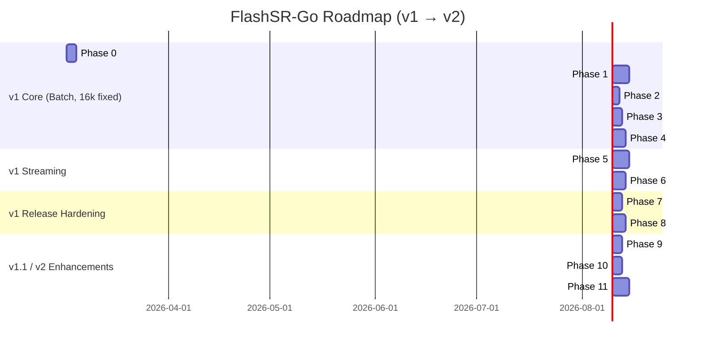

# FlashSR-Go: Development Plan

## Comprehensive Plan for `github.com/MeKo-Christian/flashsr-go`

> **For Claude:** REQUIRED SUB-SKILL: Use `superpowers:executing-plans` to implement this plan task-by-task.

This document defines a phased plan for building **FlashSR-Go** — a production-ready Go
implementation of FlashSR audio super-resolution (16 kHz → 48 kHz) with ONNX Runtime,
an optional high-quality resampler via `algo-dsp`, and a Pocket-TTS integration path.

It is intentionally separated from:

- file container concerns (`wav`) and
- application orchestration concerns.

This plan is **actionable**: every phase contains **checkable tasks and subtasks**.

---

## Table of Contents

1. Project Scope and Goals
2. Repository and Module Boundaries
3. Architecture and Package Layout
4. API Design Principles
5. Phase Overview
6. Detailed Phase Plan (Phases 0–11)
7. Appendices
   - Appendix A: Testing and Validation Strategy
   - Appendix B: Benchmarking and Performance Strategy
   - Appendix C: Dependency and Versioning Policy
   - Appendix D: Release Engineering
   - Appendix E: Risks and Mitigations
   - Appendix F: Revision History

---

## 1. Project Scope and Goals

### 1.1 Primary Goals

- Provide a standalone Go library that performs audio super-resolution: Float32 PCM at
  16 kHz in, Float32 PCM at 48 kHz out.
- Deliver a battle-tested streaming mode with upstream-compatible overlap (500 samples),
  crossfade, and "first chunk" trimming — so artifact profiles match the Python reference.
- Ship a CLI (`flashsr`) that reads WAV, upsample, and writes 48 kHz WAV.
- Keep the ORT binding behind a clean `Engine` interface so future backends slot in without
  touching the public API.
- Embed the ONNX model at compile time so the binary is self-contained by default.

### 1.2 Included Scope (v1)

- `flashsr` public library: `New`, `Close`, `Upsample16kTo48k`, `Config`.
- `flashsr/engine` interface + `flashsr/engine/ort` default implementation via
  `yalue/onnxruntime_go` (cgo, dynamic `dlopen`).
- `flashsr/model` model loader: embedded ONNX + `--model-path` / `FLASHSR_MODEL_PATH`
  override.
- `flashsr/stream` streaming wrapper: ring buffer, overlap, crossfade, output generator.
- `cmd/flashsr` CLI: `upsample` subcommand (batch + streaming), `doctor` subcommand
  (ORT library check).

### 1.3 Included Scope (v1.1 / v2)

- `flashsr/resample` internal linear resampler for non-16 kHz inputs.
- `flashsr/resample` build-tag adapter for `github.com/cwbudde/algo-dsp/dsp/resample`
  (polyphase FIR, quality modes).
- Pocket-TTS post-processor integration.

### 1.4 Explicit Non-Goals

- GUI/visualization.
- Audio device APIs (ASIO/CoreAudio/JACK/PortAudio).
- File container codecs beyond minimal WAV reading/writing for the CLI.
- Multi-rate FlashSR model training or ONNX export.
- Pure-Go neural-net inference.

---

## 2. Repository and Module Boundaries

### 2.1 Ownership Model

- `github.com/MeKo-Christian/flashsr-go`: inference library + streaming + CLI.
- `github.com/cwbudde/algo-dsp`: polyphase FIR resampler (consumed via build tag, not
  hard-wired).
- `github.com/cwbudde/wav`: WAV I/O (consumed in CLI layer only).
- `github.com/yalue/onnxruntime_go`: ONNX Runtime cgo binding (default engine).

### 2.2 Boundary Rules

- No dependency on Wails/React/app-specific frameworks.
- No direct dependency on application logging/config frameworks.
- `flashsr` public API is transport-agnostic (PCM in, PCM out).
- WAV I/O lives only in `cmd/flashsr`, never in the library.
- `algo-dsp` dependency is gated behind build tag `algodsp` — default build has zero
  dependency on it.

---

## 3. Architecture and Package Layout

```plain
flashsr-go/
├── go.mod
├── README.md
├── PLAN.md
├── NOTICE
├── LICENSE
├── .golangci.yml
├── justfile
├── assets/
│   └── model.onnx              # embedded via go:embed (~499 kB, Apache-2.0)
├── flashsr/                    # Public library
│   ├── flashsr.go              # New, Close, Upsample16kTo48k, Config, Upsampler
│   ├── flashsr_test.go
│   └── errors.go
├── engine/                     # Engine interface + shared types
│   ├── engine.go               # Engine interface, EngineInfo
│   └── ort/
│       ├── ort.go              # ORT implementation (yalue/onnxruntime_go)
│       └── ort_test.go
├── model/
│   ├── model.go                # Loader: embedded + file override
│   └── model_test.go
├── stream/
│   ├── stream.go               # Streamer: ring buffer, overlap, crossfade
│   └── stream_test.go
├── resample/
│   ├── resample.go             # Resampler interface + linear default
│   ├── resample_algodsp.go     # build tag: algodsp
│   └── resample_test.go
├── internal/
│   └── testutil/               # WAV fixtures, float comparison helpers
└── cmd/
    └── flashsr/
        ├── main.go
        ├── cmd_upsample.go
        └── cmd_doctor.go
```

Notes:

- `internal/testutil` is test support only; never imported by the library.
- Stable APIs live in non-`internal` packages.
- The `engine/ort` package requires cgo and a path to the ORT shared library
  (`libonnxruntime.so` / `.dylib` / `.dll`). This is documented prominently.

---

## 4. API Design Principles

- Prefer small interfaces and concrete constructors.
- Deterministic behavior for same input/options (no hidden global state).
- Clear error semantics (`fmt.Errorf("flashsr: %w", err)`).
- Streaming-friendly APIs: `Streamer.Write([]float32) error` / `Streamer.Read([]float32) (int, error)`.
- Zero extra allocations on the hot inference path (reuse tensor memory).
- All public types and functions require doc comments.
- Numeric behaviour: input clamped to `[-1, 1]`; output normalized to ≤ 0.999 peak (matching Python upstream).

API shape:

```go
// Library
func New(cfg Config) (*Upsampler, error)
func (u *Upsampler) Upsample16kTo48k(x []float32) ([]float32, error)
func (u *Upsampler) Close() error

// Streaming
func NewStreamer(u *Upsampler, cfg StreamConfig) *Streamer
func (s *Streamer) Write(samples []float32) error
func (s *Streamer) Read(out []float32) (int, error)
func (s *Streamer) Flush() error
func (s *Streamer) Reset()

// Engine interface (internal use / advanced)
type Engine interface {
    Run(input []float32) ([]float32, error)
    Close() error
    Info() EngineInfo
}
```

---

## 5. Phase Overview

```plain
Phase 0:  Bootstrap & Governance                     [3 days]   ✅ Complete
Phase 1:  Engine Interface & ORT Binding             [5 days]   ✅ Complete
Phase 2:  Model Handling (embed + path override)     [2 days]   🔄 In Progress (loader + tests done; model download + go:embed pending)
Phase 3:  Public Library & Batch Inference           [3 days]   ✅ Complete
Phase 4:  WAV I/O + CLI (upsample + doctor)          [4 days]   🔄 In Progress (Cobra scaffold done; WAV I/O pending)
Phase 5:  Streaming (Buffer, Overlap, Crossfade)     [5 days]   ✅ Complete
Phase 6:  Golden Tests vs Python Reference           [4 days]   📋 Planned
Phase 7:  Benchmarks & Thread Tuning                 [3 days]   📋 Planned
Phase 8:  CI + Release Artifacts + Licensing         [4 days]   🔄 In Progress (CI workflow done; goreleaser + THIRD_PARTY_NOTICES pending)
Phase 9:  Linear Resampler (multi-rate v1.1)         [3 days]   ✅ Complete
Phase 10: algo-dsp Resampler (build tag)             [3 days]   📋 Planned
Phase 11: Pocket-TTS Post-Processor Integration      [5 days]   📋 Planned
```

---

## 6. Detailed Phase Plan

### Phase 0: Bootstrap & Governance

**Goal:** Working repo with module, justfile, lint, CI skeleton, and NOTICE.

**Files:**

- Create: `go.mod`
- Create: `justfile`
- Create: `.golangci.yml`
- Create: `.github/workflows/ci.yml`
- Create: `NOTICE`
- Create: `LICENSE` (choose Apache-2.0 for FlashSR parity)

**Tasks:**

- [x] Initialize Go module
  - [x] Run `go mod init github.com/MeKo-Christian/flashsr-go`
  - [x] Set `go 1.23` minimum (matches `yalue/onnxruntime_go` header version)
  - [ ] Commit: `chore: initialize go module`

- [x] Create `justfile` with targets: `test`, `lint`, `fmt`, `bench`, `ci`, `build`

  ```makefile
  test:
      go test ./...

  lint:
      golangci-lint run ./...

  fmt:
      gofmt -w .

  bench:
      go test -bench=. -benchmem ./...

  ci: fmt lint test

  build:
      go build ./cmd/flashsr
  ```

  - [ ] Commit: `chore: add justfile`

- [x] Configure `.golangci.yml`
  - [x] Enable: `errcheck`, `govet`, `staticcheck`, `unused`, `gofmt`, `goimports`
  - [x] Set `run.timeout = 5m`
  - [ ] Commit: `chore: add golangci-lint config`

- [x] Write `NOTICE` file
  - [x] Attribute FlashSR (Apache-2.0, Hugging Face), ORT (MIT), algo-dsp (MIT, optional)
  - [ ] Commit: `chore: add NOTICE and LICENSE`

- [x] Add GitHub Actions CI
  - [x] Matrix: `ubuntu-latest` (Go 1.23 + 1.24)
  - [x] Steps: checkout → setup-go → `go test ./...` → `golangci-lint`
  - [ ] Commit: `ci: add GitHub Actions CI workflow`

Exit criteria:

- [x] `just ci` passes on a clean checkout with no source files yet.
- [x] LICENSE, NOTICE present and correct.

---

### Phase 1: Engine Interface & ORT Binding

**Goal:** A working `Engine` interface and an ORT-backed implementation that can run a real
ONNX model tensor through `Run()`.

**Files:**

- Create: `engine/engine.go`
- Create: `engine/ort/ort.go`
- Create: `engine/ort/ort_test.go`

**Background:** `yalue/onnxruntime_go` loads `libonnxruntime` dynamically via `dlopen`. It
requires cgo and a path set via `ort.SetSharedLibraryPath("/path/to/libonnxruntime.so")`.
ORT Session initialization is expensive — create once, reuse `Run()` calls (thread-safe).

**Tasks:**

- [x] Add dependency
  - [x] `go get github.com/yalue/onnxruntime_go` (v1.26.0)

- [x] Define `Engine` interface

  ```go
  // engine/engine.go
  package engine

  // EngineInfo describes the loaded model and runtime configuration.
  type EngineInfo struct {
      InputName  string
      OutputName string
      InputRank  int     // number of tensor dimensions
      Provider   string  // "CPU", "CUDA", "CoreML", etc.
      OrtVersion string
  }

  // Engine is the minimal interface for running audio super-resolution inference.
  type Engine interface {
      // Run performs inference. Input is float32 PCM [-1,1].
      // Returns upsampled output, or an error.
      Run(input []float32) ([]float32, error)
      Close() error
      Info() EngineInfo
  }
  ```

  - [x] Write test: `TestEngineInterface_Compile` (compile-time interface check via `var _ Engine = (*ort.Engine)(nil)`)
  - [x] Run test: `go test ./engine/... -v` → expect PASS

- [x] Implement ORT engine (skeleton — session wiring is a TODO)

  ```go
  // engine/ort/ort.go (skeleton)
  package ort

  import (
      "fmt"
      ort "github.com/yalue/onnxruntime_go"
      "github.com/MeKo-Christian/flashsr-go/engine"
  )

  type Config struct {
      LibraryPath    string // path to libonnxruntime shared library
      NumThreadsIntra int   // default: 1
      NumThreadsInter int   // default: 1
      InputName      string // default: auto-detect ("x" or "audio_values")
      OutputName     string // default: auto-detect ("output" or "reconstruction")
  }

  type Engine struct {
      session    *ort.DynamicAdvancedSession
      inputName  string
      outputName string
      inputRank  int
  }

  func New(modelBytes []byte, cfg Config) (*Engine, error) {
      // 1. ort.SetSharedLibraryPath(cfg.LibraryPath)
      // 2. ort.InitializeEnvironment()
      // 3. Build SessionOptions with intra/inter thread counts
      // 4. Create session from modelBytes
      // 5. Introspect input/output names and rank
      // 6. Return &Engine{...}
  }

  func (e *Engine) Run(input []float32) ([]float32, error) { ... }
  func (e *Engine) Close() error                           { ... }
  func (e *Engine) Info() engine.EngineInfo                { ... }
  ```

  - [x] Write test: `TestORT_RunSmoke` (skip guard in place for missing ORT lib)
  - [x] Write test: `TestNew_NoLibPath`, `TestNew_EmptyModel`
  - [x] Run: `go test ./engine/ort/... -v` → PASS (smoke skips without ORT lib)

- [ ] Input tensor shape handling (pending real ORT session)
  - [ ] Support both `[1, N]` (README shape) and `[1, 1, N]` (streaming code shape)
  - [ ] Detect rank from model metadata at session init time
  - [ ] Write test: `TestORT_ShapeDetection` (unit-level, using mock)
  - [ ] Commit: `feat(engine/ort): detect tensor rank from model metadata`

- [x] Input tensor shape handling
  - [x] `GetInputOutputInfoWithONNXData` detects names, ranks, element types at `New()` time
  - [x] `inputShape`/`outputShape` helpers produce `[1,N]` (rank 2) or `[1,1,N]` (rank 3)
  - [x] `Config.UpsampleRatio` controls output allocation (default: 3)

- [x] ORT environment singleton guard
  - [x] `SetSharedLibraryPath` + `InitializeEnvironment` both inside `initOnce.Do`
  - [x] Use `sync.Once`
  - [x] Write test: `TestConcurrentNew` — 5 goroutines concurrently, verify no panic/error

Exit criteria:

- [x] `go test ./engine/... -v` passes (integration tests skip without ORT lib).
- [x] Interface check compiles.
- [x] `go vet ./...` clean.
- [x] `go test -race ./...` passes.

---

### Phase 2: Model Handling

**Goal:** A model loader that returns `[]byte` from embedded ONNX, a file path, or
`FLASHSR_MODEL_PATH` env var. Hash verification against known SHA256.

**Files:**

- Create: `model/model.go`
- Create: `model/model_test.go`
- Create: `assets/model.onnx` (download + embed)

**Tasks:**

- [ ] Download model
  - [ ] `curl -L -o assets/model.onnx "https://huggingface.co/hance-ai/FlashSR/resolve/main/onnx/model.onnx"`
  - [ ] Verify SHA256 matches LFS pointer: `sha256sum assets/model.onnx`
  - [ ] Populate `ExpectedSHA256` constant in `model.go`
  - [ ] Uncomment `//go:embed ../assets/model.onnx` in `model.go`
  - [ ] Commit: `chore(assets): embed FlashSR ONNX model (Apache-2.0)`

- [x] Implement model loader (`model/model.go`)
  - [x] Priority chain: env → Config.Path → embedded
  - [x] `verifyHash` helper using `crypto/sha256`
  - [x] Write test: `TestLoad_NoEmbedNoPath` — error when nothing available
  - [x] Write test: `TestLoad_FromPath` — loads from temp file
  - [x] Write test: `TestLoad_EnvOverride` — env takes priority over Config.Path
  - [x] Write test: `TestLoad_HashVerification_BadData` — skip guard until SHA256 pinned
  - [x] Run: `go test ./model/... -v` → all PASS
  - [ ] Commit: `feat(model): implement embedded model loader with hash pinning`

Exit criteria:

- [x] `go test ./model/... -v` all pass.
- [ ] Hash pinning guards against accidental model swap. ← pending model download

---

### Phase 3: Public Library & Batch Inference

**Goal:** The `flashsr` package — a one-stop shop for "give me 48 kHz audio".

**Files:**

- Create: `flashsr/flashsr.go`
- Create: `flashsr/errors.go`
- Create: `flashsr/flashsr_test.go`

**Tasks:**

- [x] Write tests with mock engine (`mockEngine` — no ORT required)
  - [x] `TestUpsample_Shape` — output is 3× input length
  - [x] `TestUpsample_EmptyInput` — error on nil input
  - [x] `TestUpsample_ClampInput` — out-of-range samples clamped; output ≤ 1.0
  - [x] `TestUpsample_NoNaN` — no NaN/Inf in output
  - [x] `TestUpsample_PeakNormalized` — peak ≤ 1.0
  - [x] `TestNew_EngineInitError` — errors.Is check on typed sentinels
  - [x] Run: `go test ./flashsr/... -v` → all PASS

- [x] Implement `flashsr.go`
  - [x] `New(cfg Config) (*Upsampler, error)` wiring model + ort engine
  - [x] `NewWithEngine(eng engine.Engine)` for mock-based tests
  - [x] `Upsample16kTo48k` with clamp + `eng.Run` + peak-norm
  - [x] `EngineInfo()`, `Close()`
  - [ ] Commit: `feat(flashsr): implement Upsampler with batch Upsample16kTo48k`

- [x] Write `errors.go` with `ErrModelLoad`, `ErrEngineInit`, `ErrInferFailed`
  - [ ] Commit: `feat(flashsr): add typed error sentinels`

Exit criteria:

- [x] `go test ./flashsr/... -v` passes (mock-backed tests all pass; ORT-backed tests skip).
- [x] `go vet ./...` clean.

---

### Phase 4: WAV I/O + CLI

**Goal:** A `flashsr upsample` CLI that converts WAV files. A `flashsr doctor` subcommand that
verifies the ORT library path and prints version information.

**Files:**

- Create: `cmd/flashsr/main.go`
- Create: `cmd/flashsr/cmd_upsample.go`
- Create: `cmd/flashsr/cmd_doctor.go`

**Background:** Use `github.com/cwbudde/wav` for WAV reading/writing (already used in
`go-call-pocket-tts`). It provides `wav.Header` parsing and raw PCM access.

**Tasks:**

- [ ] Add wav dependency: `go get github.com/cwbudde/wav`
  - [ ] Commit: `chore: add wav dependency`

- [ ] Write failing integration test first

  ```go
  // cmd/flashsr/upsample_test.go
  func TestCLI_Upsample_Basic(t *testing.T) {
      // Write a 0.5s 16kHz sine WAV to tmp
      // Run: flashsr upsample --input tmp.wav --output out.wav
      // Read out.wav, assert sample rate == 48000
      // Assert length ~= input_samples * 3
  }
  ```

  - [ ] Run: `go test ./cmd/flashsr/... -v` → FAIL

- [x] Implement Cobra CLI scaffold
  - [x] `main.go` — `rootCmd()` with `SilenceUsage`, env-var help text
  - [x] `cmd_upsample.go` — Cobra command with all flags (`--input`, `--output`,
        `--model-path`, `--ort-lib`, `--threads`, `--stream`, `--chunk-size`);
        `--input` and `--output` marked required
  - [x] `cmd_doctor.go` — model + engine diagnostics with structured output
  - [ ] Wire WAV decode/encode (`cwbudde/wav`) in `runUpsample`
  - [ ] Assert SampleRate == 16000 on input; reject others with clear message
  - [ ] Commit: `feat(cmd): implement flashsr upsample and doctor subcommands`

- [x] `go build ./cmd/flashsr` succeeds
- [ ] Run: `go test ./cmd/flashsr/... -v` → PASS (pending WAV I/O)

Exit criteria:

- [x] `go build ./cmd/flashsr` succeeds.
- [ ] `go test ./cmd/flashsr/... -v` passes (skips gracefully without ORT lib).
- [x] `flashsr --help` shows meaningful subcommand descriptions.

---

### Phase 5: Streaming Mode

**Goal:** A `Streamer` that processes real-time chunks with upstream-compatible overlap (500
samples), crossfade, and first-chunk trimming (−2000 samples).

**Files:**

- Create: `stream/stream.go`
- Create: `stream/stream_test.go`

**Background (upstream Python reference):**

- Input ring buffer: 30 s @ 16 kHz = 480 000 samples max.
- Chunk size: default 4000 samples (250 ms @ 16 kHz).
- Overlap: last 500 input samples prepended to next chunk.
- Inference shape: `[1, 1, chunkSize+500]`.
- Output alignment: use `upsampled[1000:]` (skip first 1000 output samples = `1500 - 500`).
- Crossfade: linear ramp over `500 * 3 = 1500` output samples between previous tail and new head.
- First chunk: trim 2000 output samples from the first yield (`get_output`).

**Tasks:**

- [x] Write tests
  - [x] `TestStreamer_Write_Read_Basic` — buffered output after one full chunk
  - [x] `TestStreamer_OutputNoNaN` — no NaN/Inf in two-chunk output
  - [x] `TestStreamer_Reset_Deterministic` — same input after Reset → identical output
  - [x] `TestStreamer_Flush` — partial chunk flushed correctly
  - [x] `TestStreamer_CrossfadeSmooth` — max jump < 1.5 for mock engine
  - [x] Run: `go test ./stream/... -v` → all PASS

- [x] Implement `stream.go`

  ```go
  package stream

  type StreamConfig struct {
      ChunkSize   int // default: 4000 (samples @ 16 kHz)
      Overlap     int // default: 500
      BufferCap   int // default: 480000 (30s @ 16kHz)
  }

  type Streamer struct {
      eng         engine.Engine
      cfg         StreamConfig
      inputBuf    []float32    // ring/growing buffer
      overlapBuf  []float32    // last `overlap` samples of input
      outputBuf   []float32    // accumulated output
      firstChunk  bool
      crossfadeTail []float32  // last 1500 output samples for next crossfade
  }

  func New(eng engine.Engine, cfg StreamConfig) *Streamer

  // Write pushes new input samples into the streamer.
  func (s *Streamer) Write(samples []float32) error

  // Read pops up to len(out) output samples.
  // Returns n, io.EOF when flushed.
  func (s *Streamer) Read(out []float32) (int, error)

  // Flush signals end of input; processes remaining buffered samples.
  func (s *Streamer) Flush() error

  // Reset clears all internal state.
  func (s *Streamer) Reset()
  ```

  - [x] Input buffer backed by `[]float32` with `append`
  - [x] `processChunk`: prepend overlapIn → engine.Run → skip 1000 → crossfade → trim first chunk
  - [x] `applyCrossfade`: linear ramp over `overlap*3` output samples
  - [x] `Write`, `Read`, `Flush`, `Reset`, `Buffered` all implemented
  - [ ] Commit: `feat(stream): implement Streamer with overlap/crossfade/first-chunk trim`

- [x] `--stream` flag added to `cmd_upsample.go` (WAV decode wiring pending Phase 4)
  - [ ] Commit: `feat(cmd): add --stream flag to upsample subcommand`

Exit criteria:

- [x] `go test ./stream/... -v` all pass.
- [x] `go test -race ./...` passes.

---

### Phase 6: Golden Tests vs Python Reference

**Goal:** Verify that Go batch and streaming outputs match the Python upstream to within
numerical tolerance (RMS error ≤ −40 dB, no clipping, peak ≤ 1.0).

**Files:**

- Create: `internal/testutil/signals.go`
- Create: `internal/testutil/compare.go`
- Create: `internal/testutil/fixtures/` (WAV fixtures + reference outputs)

**Background:** Generate reference outputs from upstream Python:

```python
# upstream reference script (not part of this repo)
model = FASRONNX(model_path, ...)
out = model(input_pcm)
np.save("ref_batch.npy", out)
```

**Tasks:**

- [ ] Write `internal/testutil` helpers

  ```go
  // sinef32(freq, sampleRate, numSamples) []float32
  // pinkNoisef32(seed int64, numSamples int) []float32
  // loadWAV(path string) ([]float32, int, error)
  // saveWAV(path string, pcm []float32, sampleRate int) error
  // rmsError(a, b []float32) float64   // returns RMS in dB
  // peakAbs(a []float32) float32
  ```

  - [ ] Commit: `test(internal): add testutil signal generators and comparison helpers`

- [ ] Generate Python reference fixtures (manual step)
  - [ ] Create 3 test signals: 440 Hz sine (1 s), pink noise (1 s), and a 2 s sine sweep (50 Hz → 4 kHz)
  - [ ] Run Python upstream `FASRONNX` in batch mode for each → save as `fixtures/ref_batch_sine.npy`, etc.
  - [ ] Run Python upstream `StreamingFASRONNX` in streaming mode → save as `fixtures/ref_stream_sine.npy`, etc.
  - [ ] Document how to regenerate in `internal/testutil/fixtures/README.md`
  - [ ] Commit: `test(fixtures): add Python reference outputs for golden tests`

- [ ] Write golden tests (batch)

  ```go
  // flashsr/golden_test.go
  // build tag: golden (run with: go test -tags golden ./...)

  func TestGolden_Batch_Sine(t *testing.T) {
      u := requireUpsampler(t)
      input := loadFixture(t, "sine_16k.wav")
      ref := loadNPY(t, "ref_batch_sine.npy")
      out, err := u.Upsample16kTo48k(input)
      require.NoError(t, err)
      rmsDB := rmsError(out, ref)
      assert.Less(t, rmsDB, -40.0, "RMS error should be < -40 dB vs Python reference")
  }
  ```

  - [ ] Write similar tests for pink noise and sine sweep
  - [ ] Run: `go test -tags golden ./flashsr/... -v` → all PASS
  - [ ] Commit: `test(golden): add batch golden tests vs Python reference`

- [ ] Write golden tests (streaming)

  ```go
  // stream/golden_test.go (build tag: golden)

  func TestGolden_Stream_Sine(t *testing.T) {
      // Feed sine signal in 4000-sample chunks
      // Compare accumulated output to ref_stream_sine.npy
      // Allow 5% length difference due to trimming
  }
  ```

  - [ ] Run: `go test -tags golden ./stream/... -v` → all PASS
  - [ ] Commit: `test(golden): add streaming golden tests vs Python reference`

- [ ] Add property invariant tests (no build tag needed)
  ```go
  func TestProperty_NoNaN(t *testing.T)       // covers batch + stream
  func TestProperty_PeakNormalized(t *testing.T)  // peak ≤ 1.0
  func TestProperty_OutputRate(t *testing.T)  // output len ≈ input len * 3
  ```

  - [ ] Commit: `test: add property invariant tests (no-NaN, peak, rate)`

Exit criteria:

- [ ] `go test -tags golden ./... -v` all pass with RMS error ≤ −40 dB vs Python.
- [ ] `go test ./...` (without tag) all property tests pass.

---

### Phase 7: Benchmarks & Thread Tuning

**Goal:** Establish performance baselines; expose thread count knobs; document real-time factor.

**Files:**

- Create: `flashsr/bench_test.go`
- Create: `stream/bench_test.go`
- Create: `BENCHMARKS.md`

**Tasks:**

- [ ] Write benchmark suite

  ```go
  // flashsr/bench_test.go
  func BenchmarkUpsample_1s(b *testing.B)   // 16000 samples in
  func BenchmarkUpsample_10s(b *testing.B)  // 160000 samples in

  // stream/bench_test.go
  func BenchmarkStream_Chunk1000(b *testing.B)  // 62.5 ms @ 16kHz
  func BenchmarkStream_Chunk4000(b *testing.B)  // 250 ms @ 16kHz
  func BenchmarkStream_Chunk16000(b *testing.B) // 1s @ 16kHz
  ```

  - [ ] Add `b.ReportMetric(xRealtime, "x_realtime")` where:
        `xRealtime = (outputDuration / wallClock)`, `outputDuration = N * 3 / 48000`
  - [ ] Run: `go test -bench=. -benchmem ./... -run=^$ 2>&1 | tee BENCHMARKS.md`
  - [ ] Commit: `bench: add benchmarks and initial BENCHMARKS.md`

- [ ] Expose thread count in Config + CLI
  - [ ] `Config.NumThreadsIntra int` (default: 1, matches upstream)
  - [ ] `Config.NumThreadsInter int` (default: 1)
  - [ ] CLI flag: `--threads N` sets both
  - [ ] Commit: `feat: expose ORT thread count in Config and CLI`

- [ ] Run thread sweep and update BENCHMARKS.md
  - [ ] Test threads 1, 2, 4 on target machine
  - [ ] Document optimal setting for streaming (typically 1) vs batch (typically N_cpu)
  - [ ] Commit: `docs(bench): document thread sweep results`

Exit criteria:

- [ ] Benchmarks run without ORT panics.
- [ ] `BENCHMARKS.md` contains baseline numbers with machine info + Go version.
- [ ] Real-time factor ≥ 1.0 for `Chunk4000` on a 4-core modern CPU.

---

### Phase 8: CI + Release Artifacts + Licensing

**Goal:** Full CI with lint/test/race/golden; goreleaser config producing per-platform
binary bundles including the ORT shared library notice.

**Files:**

- Modify: `.github/workflows/ci.yml`
- Create: `.goreleaser.yml`
- Create: `THIRD_PARTY_NOTICES.md`

**Tasks:**

- [x] Extend CI (`.github/workflows/ci.yml`)
  - [x] Add `go test -race ./...` step
  - [x] Add `golangci-lint` step (pinned `v1.63`)
  - [x] Add `go vet ./...` step
  - [x] Conditionally run golden tests if `FLASHSR_ORT_LIB` secret is set
  - [ ] Commit: `ci: add race, vet, lint, and conditional golden test steps`

- [ ] Write `THIRD_PARTY_NOTICES.md`
  - [ ] FlashSR model: Apache-2.0, HF repo link, SHA256 of pinned artefact
  - [ ] ONNX Runtime: MIT
  - [ ] `yalue/onnxruntime_go`: MIT (or applicable license)
  - [ ] `cwbudde/algo-dsp`: MIT (optional / build-tag only)
  - [ ] Commit: `chore: add THIRD_PARTY_NOTICES.md`

- [ ] Configure GoReleaser
  - [ ] Targets: `linux/amd64`, `darwin/amd64`, `darwin/arm64`
  - [ ] Each archive includes: `flashsr` binary, `README.md`, `NOTICE`, `THIRD_PARTY_NOTICES.md`
  - [ ] Commit: `ci: add goreleaser config for multi-platform releases`

- [ ] Tag and test snapshot release
  - [ ] `goreleaser release --snapshot --clean`
  - [ ] Verify archives unpack and binary runs `--help`
  - [ ] Commit: `chore: verify goreleaser snapshot build`

Exit criteria:

- [x] `just ci` passes including race.
- [ ] GoReleaser snapshot produces valid archives.
- [ ] THIRD_PARTY_NOTICES.md is accurate and complete.

---

### Phase 9: Linear Resampler (Multi-Rate v1.1)

**Goal:** Accept inputs at rates other than 16 kHz by resampling down to 16 kHz first
(covers Pocket-TTS 24 kHz → 16 kHz → FlashSR → 48 kHz).

**Files:**

- Create: `resample/resample.go`
- Create: `resample/linear.go`
- Create: `resample/resample_test.go`

**Tasks:**

- [x] Define `Resampler` interface (`resample/resample.go`)
  - [x] `Process(in []float32) ([]float32, error)`
  - [x] `Reset()`
  - [x] `NewFor(inRate, outRate int) (Resampler, error)` with passthrough for equal rates
  - [ ] Commit: `feat(resample): define Resampler interface`

- [x] Write tests
  - [x] `TestNewFor_SameRate` — passthrough returns equal-length output
  - [x] `TestNewFor_InvalidRate` — error on zero rates
  - [x] `TestLinear_24kTo16k_Length` — output ≈ 16000 samples (±2)
  - [x] `TestLinear_16kTo48k_Length` — output ≈ 48000 samples (±2)
  - [x] `TestLinear_Reset` — same input after Reset → same length
  - [x] `TestLinear_StreamingNoBoundaryJumps` — max delta < 0.35 across chunk boundaries
  - [x] Run: `go test ./resample/... -v` → all PASS

- [x] Implement `linear.go` (`//go:build !algodsp`)
  - [x] Stateful fractional phase preserved across `Process` calls
  - [x] `prev` sample carried for cross-chunk interpolation
  - [ ] Commit: `feat(resample): implement stateful linear resampler`

- [ ] Wire into `flashsr.New` via `Config.InputRate int`
  - [ ] If `InputRate != 0 && InputRate != 16000`, insert resampler stage before ORT
  - [ ] Commit: `feat(flashsr): add multi-rate input via linear resampler`

Exit criteria:

- [x] `go test ./resample/... -v` all pass.
- [ ] CLI accepts `--input-rate 24000` and produces correct 48 kHz output.

---

### Phase 10: algo-dsp Resampler (Build Tag)

**Goal:** High-quality polyphase FIR resampler via `algo-dsp` as an opt-in build tag,
keeping the zero-dependency default binary.

**Files:**

- Create: `resample/resample_algodsp.go` (`//go:build algodsp`)
- Create: `resample/resample_linear.go` (`//go:build !algodsp`)
- Modify: `resample/resample.go`

**Background:** `algo-dsp/dsp/resample` offers:

- `NewRational(up, down int, opts...Option) (*Resampler, error)`
- `WithQuality(QualityFast | QualityBalanced | QualityBest)`
- Profiles: Fast (16 taps, ~55 dB stopband), Balanced (32 taps, ~75 dB), Best (64 taps, ~90 dB)
- Operates on `float64`; we must convert `float32 ↔ float64`

**Tasks:**

- [ ] Refactor `resample.go` to have two build-tag files
  - [ ] `resample_linear.go` — `//go:build !algodsp` — wraps current linear impl
  - [ ] `resample_algodsp.go` — `//go:build algodsp` — wraps algo-dsp

- [ ] Write test that runs under both tags

  ```go
  // resample/resample_test.go (no build tag — runs always)
  func TestNewFor24kTo16k(t *testing.T) {
      r, err := NewFor(24000, 16000)
      require.NoError(t, err)
      // Same quality test as Phase 9
  }
  ```

- [ ] Implement algo-dsp adapter

  ```go
  //go:build algodsp

  package resample

  import (
      algoresample "github.com/cwbudde/algo-dsp/dsp/resample"
  )

  type algoDSPResampler struct {
      r       *algoresample.Resampler
      inRate  int
      outRate int
  }

  func newResampler(inRate, outRate int) (Resampler, error) {
      // Compute GCD reduction for up/down ratio
      // Create algoresample.NewRational(up, down, algoresample.WithQuality(algoresample.QualityBalanced))
      // Return &algoDSPResampler{...}
  }

  func (a *algoDSPResampler) Process(in []float32) ([]float32, error) {
      // Convert float32 → float64
      // r.Process(in64) → out64
      // Convert float64 → float32
  }
  ```

  - [ ] Add conditional dependency: `go get github.com/cwbudde/algo-dsp` (only needed with tag)
  - [ ] Commit: `feat(resample): add algo-dsp polyphase FIR resampler via build tag algodsp`

- [ ] Test with tag

  ```bash
  go test -tags algodsp ./resample/... -v
  ```

  - [ ] Assert tests pass
  - [ ] Assert `BenchmarkResample_24kTo16k` shows algo-dsp provides lower RMS noise vs linear
  - [ ] Commit: `test(resample): verify algo-dsp adapter matches interface contract`

- [ ] Add CLI flag `--resampler [linear|algodsp]` (shows error if binary not built with tag)
  - [ ] Commit: `feat(cmd): expose resampler backend selection in CLI`

Exit criteria:

- [ ] `go test ./resample/...` passes (linear, no tag).
- [ ] `go test -tags algodsp ./resample/...` passes (algo-dsp adapter).
- [ ] Neither build breaks `go vet ./...`.

---

### Phase 11: Pocket-TTS Post-Processor Integration

**Goal:** A `PostProcessor` interface in this repo that wraps the full pipeline:
Pocket-TTS WAV output (24 kHz) → resample → FlashSR → 48 kHz WAV. Useful for callers
that hold a `go-call-pocket-tts` `WAVResult`.

**Files:**

- Create: `pockettts/processor.go`
- Create: `pockettts/processor_test.go`

**Background:** `go-call-pocket-tts` returns `WAVResult{Data []byte, SampleRate int, ...}`.
`SampleRate` is 24000 Hz by default. PCM is int16 LE; we convert to float32.

**Tasks:**

- [ ] Define `PostProcessor` interface

  ```go
  // pockettts/processor.go
  package pockettts

  // PostProcessor takes raw PCM (any sample rate) and returns 48kHz upsampled PCM.
  type PostProcessor interface {
      Process(pcm []float32, inSampleRate int) (out []float32, outSampleRate int, err error)
  }

  // WAVResult mirrors go-call-pocket-tts WAVResult to avoid a hard dependency.
  type WAVResult struct {
      PCM        []float32
      SampleRate int
  }

  // ProcessWAVResult is a convenience wrapper.
  func ProcessWAVResult(p PostProcessor, r WAVResult) ([]float32, error)
  ```

  - [ ] Commit: `feat(pockettts): define PostProcessor interface`

- [ ] Write failing tests

  ```go
  func TestFlashSRPost_24kTo48k(t *testing.T) {
      u := requireUpsampler(t)
      proc := NewFlashSRProcessor(u, 24000)
      in := sinef32(440, 24000, 24000) // 1s @ 24kHz
      out, rate, err := proc.Process(in, 24000)
      require.NoError(t, err)
      assert.Equal(t, 48000, rate)
      assert.InDelta(t, 48000, len(out), 100)
  }
  ```

  - [ ] Run: `go test ./pockettts/... -v` → FAIL

- [ ] Implement `FlashSRProcessor`

  ```go
  type FlashSRProcessor struct {
      upsampler  *flashsr.Upsampler
      resampler  resample.Resampler // nil if inRate == 16000
  }

  func NewFlashSRProcessor(u *flashsr.Upsampler, inputSampleRate int) *FlashSRProcessor {
      // If inputSampleRate != 16000, build resample.NewFor(inputSampleRate, 16000)
  }

  func (p *FlashSRProcessor) Process(pcm []float32, inSampleRate int) ([]float32, int, error) {
      // 1. If inSampleRate != 16000: resample → 16kHz
      // 2. u.Upsample16kTo48k(pcm16k)
      // 3. Return (out, 48000, nil)
  }
  ```

  - [ ] Run: `go test ./pockettts/... -v` → PASS
  - [ ] Commit: `feat(pockettts): implement FlashSRProcessor for 24kHz→48kHz pipeline`

- [ ] Write helper: `Int16ToFloat32(pcm []int16) []float32`
  - [ ] Divides by 32768.0, clamps to [-1,1]
  - [ ] Write test: `TestInt16ToFloat32_Roundtrip`
  - [ ] Commit: `feat(pockettts): add Int16ToFloat32 PCM conversion helper`

- [ ] Add example
  ```go
  // pockettts/example_test.go
  func ExampleFlashSRProcessor() {
      // Show minimal pipeline: WAVResult → FlashSRProcessor → save 48kHz WAV
  }
  ```

  - [ ] Commit: `docs(pockettts): add runnable example`

Exit criteria:

- [ ] `go test ./pockettts/... -v` passes (skips without ORT lib).
- [ ] Integration: a caller can combine `go-call-pocket-tts` with `flashsr-go` in ~10 lines.

---

## 7. Roadmap (Gantt)



---

## Appendix A: Testing and Validation Strategy

### A.1 Test Types

- Unit tests (table-driven, edge-case heavy).
- Property/invariant tests (no NaN/Inf, peak ≤ 1.0, output rate = 3×).
- Golden vector tests (Go vs Python upstream, gated by `//go:build golden` tag).
- Integration tests across package boundaries.
- Race tests: `go test -race ./...` must always pass.

### A.2 Numerical Validation

- Tolerance policy: RMS error ≤ −40 dB vs Python reference (batch); ≤ −35 dB (streaming,
  allowing for minor alignment differences).
- Crossfade smoothness: no discontinuity > 0.05 between chunks.
- Peak normalization: output peak ∈ [0.0, 1.0] for any non-silent input.

### A.3 Coverage Targets

- `flashsr/`, `stream/`, `resample/`, `model/`: ≥ 85%.
- `engine/ort/`: ≥ 70% (many paths require ORT lib, skip-gated).

### A.4 Golden Test Fixtures

Fixtures are committed in `internal/testutil/fixtures/`:

- `sine_16k.wav` — 1 s, 440 Hz sine at 16 kHz
- `pinknoise_16k.wav` — 1 s pink noise at 16 kHz
- `sweep_16k.wav` — 2 s sweep 50 Hz→4 kHz at 16 kHz
- `ref_batch_sine.npy`, `ref_batch_noise.npy`, `ref_batch_sweep.npy` — Python batch outputs
- `ref_stream_sine.npy` — Python streaming output

Regeneration instructions live in `internal/testutil/fixtures/README.md`.

---

## Appendix B: Benchmarking and Performance Strategy

Maintain microbenchmarks for all hot paths. Key families:

| Benchmark               | Signal          | Expected Result (target)   |
| ----------------------- | --------------- | -------------------------- |
| `BenchmarkUpsample_1s`  | 16000 samp      | ≥ 2× realtime (any CPU)    |
| `BenchmarkUpsample_10s` | 160000 samp     | same realtime factor       |
| `BenchmarkStream_1000`  | 1000 samp/chunk | ≥ 1× realtime              |
| `BenchmarkStream_4000`  | 4000 samp/chunk | ≥ 5× realtime              |
| `BenchmarkResample_24k` | 24000→16000     | 0 extra allocs/op (linear) |

Track `allocs/op`, `bytes/op`, and `ns/op`. Update `BENCHMARKS.md` on each release with
date, Go version, and machine info.

---

## Appendix C: Dependency and Versioning Policy

- `yalue/onnxruntime_go`: pin ORT header version (≥ 1.24.1); update deliberately.
- `github.com/cwbudde/algo-dsp`: pin to `v0.x` tag; do not auto-upgrade.
- `github.com/cwbudde/wav`: pin to latest stable.
- Zero external dependencies on the hot inference path beyond ORT binding.
- `algo-dsp` must never appear in the default (no-tag) build graph.
- Minimum Go: 1.23 (embed, generics stable, slices package).

---

## Appendix D: Release Engineering

- Conventional commits for changelog generation.
- Tag-driven releases with GoReleaser.
- Pre-release channel (`v0.x`) until API freeze.
- Required release gates:
  - `golangci-lint` pass
  - `go test -race ./...` pass
  - `go test -tags golden ./...` pass (with ORT lib in CI secret)
  - BENCHMARKS.md baseline updated

**Distribution note:** The binary depends on `libonnxruntime` as a shared library.
Every release README must document:

1. Where to download the matching ORT release.
2. How to set `FLASHSR_ORT_LIB` or `LD_LIBRARY_PATH`.
3. How to run `flashsr doctor` to verify setup.

---

## Appendix E: Risks and Mitigations

| Risk                                               | Impact | Mitigation                                                                        |
| -------------------------------------------------- | ------ | --------------------------------------------------------------------------------- |
| ORT tensor name mismatch (`x` vs `audio_values`)   | High   | Introspect model metadata at session init; configurable fallback                  |
| ORT version/header mismatch in CI                  | Medium | Pin ORT version; document exact `libonnxruntime` version required                 |
| First-chunk / offset alignment differs from Python | High   | Golden tests with Python-generated fixtures; adjustable offset                    |
| cgo cross-compilation difficulties                 | Medium | Use per-OS native CI runners; document cross-compile limitations                  |
| algo-dsp API changes (v0.x)                        | Low    | Pin specific tag; build-tag isolation means breakage is silent until user opts in |
| FlashSR model license ambiguity                    | Medium | Verify Apache-2.0 on HF; include NOTICE with hash + source URL                    |
| ORT concurrency bugs on session init               | Low    | `sync.Once` for environment; serial session construction                          |

---

## Appendix F: Revision History

| Version | Date       | Author | Changes                                                            |
| ------- | ---------- | ------ | ------------------------------------------------------------------ |
| 0.1     | 2026-02-27 | Claude | Initial comprehensive plan from goal.md                            |
| 0.2     | 2026-02-27 | Claude | Marked completed scaffolding: Phases 0/3/5/9 ✅; Phases 1/2/4/8 🔄 |

---

This plan is a living document and should be updated after each phase completion and major
architectural decision.
