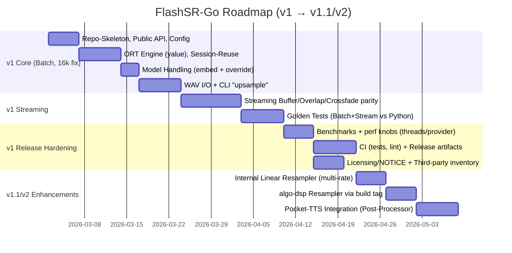

# Implementierungsplan für eine Go-Neuschreibung von FlashSR mit ONNX Runtime, optionalem algo-dsp und Pocket‑TTS‑Integration

## Executive Summary

Ziel ist eine **produktreife Go-Implementierung** von FlashSR (Inference‑only), die in **v1** bewusst pragmatisch startet: **ONNX Runtime als Backend**, **16 kHz Eingangssamplerate fix**, **48 kHz Output**, **Session‑Reuse** und ein **CLI**, das WAV-Dateien konvertiert. FlashSR selbst ist als „tiny audio super-resolution“-Modell positioniert und skaliert 16 kHz Audio nach 48 kHz; die Projekt-Dokumentation nennt zudem eine ONNX-Variante mit ~500 kB. citeturn1view0turn15view0turn16search4

Die Kerndesignentscheidung für v1 ist ein **Engine‑Interface** (z. B. `Engine.Run(...)`) mit einer Default-Implementation via **ONNX Runtime C API Bindings in Go** (empfohlen: `yalue/onnxruntime_go`), plus ein **Streaming-Layer**, der die upstream-Logik (Buffering, `overlap=500`, Crossfade, „first chunk“-Regel) so exakt wie sinnvoll nachbildet, um vergleichbare Qualität/Artefaktprofile zu erreichen. Die upstream Streaming-Referenz nutzt u. a. einen Eingangsringbuffer (30 s @ 16 kHz), überlappende Chunks (letzte 500 Samples), lineares Crossfade und eine erste Ausgabe, die um 2000 Samples gekürzt wird. citeturn4view0turn17view1

„Standalone“ wird so interpretiert: **keine Python-Abhängigkeit**, keine harte Bindung an dein `algo-dsp` – aber **ONNX Runtime als Shared Library** bleibt (wie bei allen ORT-basierten Ansätzen) eine native Laufzeitkomponente. `yalue/onnxruntime_go` lädt diese Library dynamisch (`dlopen`/`LoadLibrary`) und verlangt `cgo`. citeturn24view0turn24view1turn24view2  
Optional kann `algo-dsp` für **hochwertiges Resampling** zugeschaltet werden (Build‑Tag), da es einen Polyphase‑FIR Resampler mit Qualitätsprofilen anbietet. citeturn12view0turn14view0

Für Pocket‑TTS ist eine klare Synergie möglich: dein `go-call-pocket-tts` liefert WAV‑Bytes + SampleRate (Kommentar: Pocket‑TTS erzeugt 24000 Hz) und unterstützt CLI‑ sowie Server‑Mode (warm gehaltenes Modell). citeturn10view0turn10view1turn6view0  
Die Pocket‑TTS Python API bietet zudem explizit **Streaming‑Audioausgabe** (`generate_audio_stream`). citeturn20view0  
Empfohlen ist eine Integration über ein **Post‑Processor‑Interface** (Offline: WAV→PCM→FlashSR→WAV; später Streaming: Chunk‑Pipeline).

Risiken/Unschärfen: FlashSR zeigt in README und Streaming‑Code unterschiedliche Tensor‑Namen und Input‑Shapes (README: `{"audio_values": [1,N]}` → Output `"reconstruction"`; Streaming: Input-Key `'x'` mit Shape `[1,1,N]`). Das Go‑Design sollte deshalb **Tensor‑Namen/Layouts introspektieren** oder konfigurierbar machen. citeturn1view0turn4view0turn17view1

## Projektziele und Scope

Die FlashSR‑Basisbehauptung ist: **Audio‑Super‑Resolution** von **16 kHz → 48 kHz** (3×) bei sehr hoher Geschwindigkeit. citeturn1view0turn15view0turn17view1  
Die wissenschaftliche Veröffentlichung beschreibt FlashSR als „one-step diffusion“-Modell, das „von 4 kHz bis 32 kHz auf 48 kHz“ hochsampeln kann. Das ist jedoch **nicht automatisch gleichbedeutend** damit, dass das konkret bereitgestellte kleine ONNX‑Artefakt Multi‑Rate unterstützt; der öffentlich beworbene HF‑Artefakt nennt explizit **Input 16 kHz / Output 48 kHz**. citeturn0search10turn15view0

### Ziele für v1

v1 liefert „Feature‑Complete“ für typische Produktnutzung mit minimalen Komplexitätskosten:

Eine Go‑Library, die PCM‑Float (‑1…1) bei 16 kHz annimmt und 48 kHz PCM zurückgibt. Upstream validiert Eingaben als `float32` im Bereich [-1, 1] und normalisiert Outputs auf ~0.999 Peak; diese Verhalten sollten für Parität in Go abgebildet werden. citeturn4view0turn4view1

Ein CLI, das WAV‑Input liest, 16 kHz erzwingt (oder optional in v1.1 resampelt), FlashSR ausführt und 48 kHz WAV schreibt.

Streaming‑Modus (Chunk‑basierte Verarbeitung) mit dem upstream‑Verhalten: Input‑Buffer, `overlap=500`, Crossfade, und „first chunk“-Regel. citeturn4view0turn17view1

### Erweiterungen später

Resampling für andere Eingangsraten (insb. Pocket‑TTS 24 kHz) ist der wichtigste „Phase 2“-Baustein. Pocket‑TTS dokumentiert eine SampleRate „typisch 24000 Hz“. citeturn20view0turn10view0  
Hier sind zwei realistische Strategien:

Resample‑to‑16k: Jede Eingangsrate wird auf 16 kHz resampelt, dann FlashSR 16→48 angewendet. Das ist sofort kompatibel mit dem existierenden FlashSR‑Artefakt. (Empfohlen für kurzfristige Produktivität.)

Echtes Multi‑Rate: Falls ein Multi‑Rate‑FlashSR‑Checkpoint/Export verfügbar wird (oder selbst exportiert/trainiert), könnte man den Resampler‑Schritt reduzieren. Das ist jedoch „high effort / high risk“, da das veröffentlichte ONNX‑Artefakt in der Community primär als 16 kHz→48 kHz verwendet wird. citeturn0search10turn15view0turn17view1

## Zielarchitektur und Modul‑/Paketlayout

### High‑Level Architektur

Das Go‑Projekt sollte bewusst in klare Schichten geschnitten werden:

**Public API (Library)**: stabile, kleine Oberfläche (Batch + Streaming), unabhängig von konkreter ONNX‑Binding-Wahl.

**Engine Layer**: ONNX Runtime Session‑Management, Tensor‑IO, Provider‑Auswahl, Threading; austauschbar über Interfaces.

**Signal Processing Layer**: Streaming‑Glue (Buffering/Crossfade) und später Resampling; optional `algo-dsp` via Build‑Tags.

**CLI**: Datei‑I/O, Flag‑Parsing, Logging, Auslieferung.

Diese Schichtung ist wichtig, weil ORT‑Bindings (cgo vs purego), Model‑Distribution (embedded vs download) und Resampling‑Backend sich später ändern können, ohne die Public API zu brechen.

### Konkretes Paketlayout

Ein praktikables Layout (Go‑Module: z. B. `github.com/<you>/go-flashsr`):

`flashsr`  
Public Library: `New`, `Close`, `Upsample16kTo48k`, Konfiguration, Error‑Types.

`flashsr/engine`  
Interfaces + gemeinsame Typen:
- `type Engine interface { Run(input []float32) ([]float32, error); Close() error; Info() EngineInfo }`
- `type EngineInfo struct { InputName, OutputName string; InputRank int; Provider string; OrtVersion string }`

`flashsr/engine/ort`  
Default‑Implementation v1 via ONNX Runtime (`yalue/onnxruntime_go`). Diese Library verlangt cgo und einen Pfad zur ORT Shared Library (`SetSharedLibraryPath`), und unterstützt laut README getestete Execution Provider wie TensorRT/CUDA/CoreML. citeturn24view0turn0search1turn0search4

`flashsr/model`  
Model‑Loader/Resolver: embedded ONNX, File‑Path override, optional HF‑Download, Hash‑Pinning.

`flashsr/stream`  
Streaming‑Wrapper (Ringbuffer, Overlap, Crossfade, Output‑Generator).

`flashsr/resample`  
Resampler‑Interface + Default (linear) + optional algo-dsp Adapter unter Build‑Tag.

`cmd/flashsr`  
CLI mit Subcommands (Batch/Stream) und optionalen Tools (Model/ORT download).

### Public APIs

Eine minimale, aber zukunftsfähige API:

`flashsr.New(cfg Config) (*Upsampler, error)`  
Initialisiert ORT Environment/Session einmal, lädt Model und cached Tensor‑Namen/Layouts. Hinweis: ORT Session‑Initialisierung kann teuer sein, daher strikt als „einmal pro Prozess“ behandeln.

`(u *Upsampler) Upsample16kTo48k(x []float32) ([]float32, error)`  
Batch‑Inference: erwartet Float32 PCM in [-1,1]. Upstream erzwingt diesen Wertebereich und normalisiert Output auf ~0.999 Peak. citeturn4view0turn4view1

`flashsr.NewStreamer(u *Upsampler, cfg StreamConfig) *Streamer`  
Streaming‑Pipeline, die `ProcessInput(chunk)` annimmt und 48 kHz Chunks ausgibt.

Für spätere Erweiterung (ohne Breaking Change):  
`(u *Upsampler) Upsample(x []float32, inRate int) ([]float32, outRate int, error)` – initial kann `inRate!=16000` Fehler werfen; später Resampling einschalten.

## Inferenz-Backend: ONNX Runtime Bindings, Engine‑Alternativen und Model‑Distribution

### Vergleich von Go‑Bindings für ONNX Runtime

Für die v1‑Entscheidung sind vier Kriterien besonders relevant: Stabilität/Adoption, Plattformabdeckung, Packaging/Standalone‑Story, und Pflegezustand.

| Binding | Technik | Stärken | Schwächen/Risiken | Passung für v1 |
|---|---|---|---|---|
| `yalue/onnxruntime_go` | cgo + dynamisches Laden (dlopen/LoadLibrary) | Reife API, pkg.go.dev‑Docs, klare Requirements (cgo + ORT Shared Lib Pfad), getestete Execution Provider inkl. TensorRT/CUDA/CoreML; Header‑Version explizit dokumentiert. citeturn24view0turn0search1turn0search4 | cgo erschwert Cross‑Compile; ORT Runtime Version muss zu den genutzten C‑Headern passen (README nennt 1.24.1). citeturn24view0 | **Empfohlen** (Default) |
| `shota3506/onnxruntime-purego` | purego (kein cgo), dynamisches Laden | Kein cgo → einfachere Builds; Binding direkt zur ORT C API. citeturn0search2turn0search12 | README markiert „currently unstable“; API‑Änderungen ohne Notice; Version‑Support 1.23.x. citeturn0search2turn0search5 | Eher **später/optional** |
| `amikos-tech/pure-onnx` | purego (kein cgo), dynamisches Laden + „Bootstrap“ | Extra‑Feature: Auto‑Download + Cache offizieller ORT Artefakte („Bootstrap mode“) mit Env‑Overrides (z. B. `ONNXRUNTIME_VERSION`). Das unterstützt deine „standalone-ish“ Story stark. citeturn23view1 | „in progress“ (Environment/Session‑Management teils im Aufbau); Produktionsreife prüfen; ebenfalls native ORT Lib nötig (wird aber automatisiert). citeturn23view1 | **Sehr interessant für v2** (Download‑Tooling) |
| `donetkit/go_onnxruntime` | cgo + dynamisches Laden | Dokumentiert Windows‑Problematik (MSVC vs MinGW) und umgeht sie durch manuelles Laden; erklärt Version‑Pinning/Library‑Handling. citeturn23view0 | Dokumentiert C‑Header 1.18.0 (potenziell alt) – modernere ORT‑Releases erfordern Updates; geringere „Mainstream“-Signalwirkung als yalue. citeturn23view0 | Nur als Fallback / Referenz |

**Empfehlung:** v1 mit `yalue/onnxruntime_go`, weil es in README/Docs explizit die Anforderungen, Version‑Pinning und Provider‑Themen abdeckt und in der Praxis weithin genutzt wird. citeturn24view0turn0search4  
Als strategische Option für „einfachere Distribution“ lohnt es, mittelfristig `pure-onnx`/purego zu evaluieren, weil die Bootstrap‑Funktion die typische ORT‑Library‑Hürde adressiert. citeturn23view1

### ONNX Runtime Tuning und Threading

Upstream Streaming initialisiert ONNX Runtime mit `SessionOptions` und setzt `intra_op_num_threads` sowie `inter_op_num_threads` auf `n_cpu` (default: 1). citeturn4view0  
ONNX Runtime dokumentiert, dass Sessions Multi‑Threading nutzen und Thread‑Zahl/Spinning für Performance/CPU‑Last relevant ist. citeturn19search0

**Implementationsschritte (v1)**  
Begründung: reproduzierbare Performance, kontrollierte CPU‑Last, Performance‑„Knobs“ im CLI.

Schritte:
- `Config.NumThreadsIntra`, `Config.NumThreadsInter` in Go.
- Default: `1` für Streaming‑Real‑Time (wie upstream) bzw. `runtime.GOMAXPROCS(0)` für Batch optional.
- Optional: `ExecutionMode` (sequential vs parallel) als Experimenteinstellung, weil zu viele Threads die Performance verschlechtern können. citeturn19search16turn19search0

Aufwand: **mittel** (weil APIs je nach Binding variieren).  
Risiken: Tuning ist workload‑ und CPU‑abhängig; falsche Defaults erzeugen „100 Threads“-Überraschungen. citeturn19search0

### Concurrency und Session‑Reuse

Für Server‑artige Nutzung (Pocket‑TTS‑Pipeline, Batch‑Jobs) ist wichtig: **Session einmal bauen**, dann `Run` wiederverwenden. ONNX Runtime beschreibt in einem Issue explizit, dass `Run()` auf derselben Session in mehreren Threads sicher aufrufbar ist (keine externe Synchronisation nötig). citeturn19search3  
Das ermöglicht zwei Muster:
- ein globaler Session‑Singleton mit concurrent `Run`
- oder ein Session‑Pool (nur wenn Binding/EP/Allocator das erfordert)

Aufwand: **niedrig** (Design) / **mittel** (Bench‑validieren).  
Risiko: Session‑Initialisierung parallel kann in manchen Umgebungen problematisch sein (es gibt neuere Diskussionen zu Thread‑Safety bei Initialisierung); daher Session‑Setup seriell halten. citeturn19search19

### Model‑Distribution: embed vs download vs extern

Das ONNX Modell liegt auf Hugging Face im Ordner `onnx/` als `model.onnx` (~499 kB). citeturn16search4turn15view0  
Die zugehörige LFS‑Pointer‑Info enthält `oid sha256:...` und `size 498624`, was sich als Integrity‑Pinning eignet. citeturn16search10turn16search12

**Optionen:**

| Option | Rationale | Schritte | Aufwand | Risiken |
|---|---|---|---|---|
| Embedded Model (Default) | Maximal „offline/standalone“; Model ist sehr klein; Go bietet `embed` für Byte‑Embedding. citeturn15view0turn25search0 | `//go:embed assets/model.onnx` → beim Start in temp/cache schreiben oder ORT aus Bytes laden (je nach Binding) | niedrig–mittel | Lizenz/NOTICE muss Modell‑Artefakt einschließen; Go‑Module enthält Binärfile |
| Download on demand | Repo bleibt schlank, Model austauschbar; kann Hash‑Pinning nutzen | CLI `flashsr model fetch` lädt HF Artefakt, prüft SHA256 aus LFS‑Pointer | mittel | First‑run benötigt Netz; HF‑Rate‑Limits/Verfügbarkeit |
| User‑Provided Path | Für integrators/embedded targets; volle Kontrolle | `--model-path` und ENV `FLASHSR_MODEL_PATH` | niedrig | Support-Aufwand („welches Modell passt?“) |

Empfehlung: **Embedded Model als Default**, plus `--model-path` Override. Go’s `embed` ist dafür gemacht, Dateien compile‑time ins Binary zu integrieren. citeturn25search0turn25search28  
Optional später: Download‑Subcommand (Hash‑Pinning über HF commit pointer). citeturn16search10turn16search4

### Alternative Inferenz‑Engines

v1 wird ORT‑basiert, aber es lohnt sich, Alternativen bewusst zu dokumentieren:

**ONNX Runtime C API via eigener cgo‑Wrapper**  
Rationale: volle Kontrolle, minimaler Layer; Nachteil: du baust im Wesentlichen ein eigenes `onnxruntime_go`. Aufwand: **hoch**; Risiko: Plattform‑ und Version‑Pflege.

**ONNX Runtime mit Execution Providers (CUDA/TensorRT/CoreML)**  
ORT unterstützt viele EPs; TensorRT EP verlangt explizite Registrierung und empfiehlt zusätzlich CUDA EP, um unsupported Nodes zu übernehmen. citeturn19search2turn19search18  
Für Go hängt das an Binding‑Support; `yalue/onnxruntime_go` nennt getestete EPs inkl. TensorRT/CUDA/CoreML. citeturn24view0turn0search1  
Aufwand: **mittel**; Risiko: massive „matrix“ aus CUDA/cuDNN‑Versionen und Packaging (ORT CUDA Build muss zur lokalen CUDA/cuDNN passen). citeturn19search28turn24view0

**TensorRT direkt (ohne ORT)**  
ONNX kann grundsätzlich mit TensorRT „gescored“ werden. citeturn16search22  
In Go wäre das aber ein C++/CUDA‑Integrationsprojekt: Aufwand **sehr hoch**, portabel nur eingeschränkt.

**Pure‑Go Inferenz ohne native Library**  
Für ONNX‑Neural‑Netze „full pure Go“ ist praktisch selten realistisch (Operator‑Abdeckung/Performance). Als „später“ Option ggf. ONNX‑Runtime Web oder Candle etc, aber nicht v1.

## Streaming-Design und Resampling-Strategien

### Streaming-Design nach upstream

Upstream Streaming (`StreamingFASRONNX`) implementiert:

Input‑Ringbuffer: `deque(maxlen=16000*30)` → 30 Sekunden Puffer bei 16 kHz. citeturn4view0

Chunking: Default `chunk_size=4000` (16 kHz) entspricht 250 ms; empfohlenes Minimum 1000 Samples (niedrige Latenz) und Maximum 16000 (höchste Qualität). citeturn4view0turn17view1

Overlap: `overlap_buffer = last 500 samples` (16 kHz) werden vor den nächsten Chunk geprepended. citeturn4view0

Inference: pro Chunk wird `model.run(None, {'x': input_chunk[None, None, :]})` ausgeführt. citeturn4view0

Crossfade: lineare Rampe über `overlap=500` Samples zwischen altem Output und neuem Chunk. citeturn4view0

Spezialregel: In `get_output(n_samples=chunk_size*3)` wird beim ersten Yield `n_samples -= 2000` angewendet. citeturn4view0turn17view1

Zusätzlich wird beim Crossfade der neue upsampled Chunk mit Offset verwendet: `upsampled_chunk[1500 - 500:]` (also ab Index 1000) – das ist ein sehr konkretes Alignment‑Heuristikdetail, das für Parität wichtig ist. citeturn4view0

**Go‑Implementationsplan (Streaming‑Modul)**  
Begründung: reproduzierbares Verhalten, bekannte Artefaktlage, einfacher Goldentest gegen Python.

Schritte:
- Ringbuffer‑Implementierung für `[]float32` (Input) mit Capacity `16k*30`.
- `ProcessInput(chunk []float32, chunkSize int)` übernimmt Samples und verarbeitet, sobald genug da ist.
- Intern: `inputChunk := append(overlapBuffer, next chunkSize samples...)`; `overlapBuffer = last 500`.
- ORT‑Run pro Chunk.
- `outputBuffer` als `[]float32` (oder ring buffer) und `crossfade(outputBuffer, newChunk[1000:], overlap=500)`.
- Generator‑ähnliche API: `PopOutput(n int) ([]float32, ok)` oder `Read(p []float32) (int, error)`.

Aufwand: **mittel** (Algorithmik klar; Perf/Alloc‑Optimierung separat).  
Risiken: Off-by-one/Alignment führt zu Clicks/Artefakten; Input/Output‑Tensor‑Layout kann je nach Modell variieren (siehe Abschnitt Inferenz). citeturn4view0turn17view1

### Resampling-Optionen

Da v1 „fixed 16 kHz“ ist, ist Resampling zunächst optional. Für Pocket‑TTS ist es aber praktisch sofort relevant: Pocket‑TTS liefert typischerweise 24 kHz. citeturn20view0turn10view0

**Resampling‑Designziel:** Eine kleine `Resampler`‑Abstraktion, die ohne `algo-dsp` funktioniert, aber mit Build‑Tag hochwertig wird.

`type Resampler interface { Process(in []float32) ([]float32, error) }`

#### Option Linear (interne Default)

Begründung: Minimaler Code, keine Dependencies, für TTS‑Upsampling‑Pipelines oft „ausreichend“, weil FlashSR danach ohnehin spektral „auffüllt“.

Schritte:
- `linearResample(inRate, outRate)` mit float32; Ratio = outRate/inRate.
- Streaming‑fähig machen (stateful fractional index), damit keine Sprünge zwischen Chunks entstehen.

Aufwand: **niedrig**.  
Risiken: Aliasing bei Downsample (z. B. 24k→16k), mögliche Qualitätseinbußen vor FlashSR.

#### Option Hochwertig via algo-dsp (Build‑Tag)

`algo-dsp` bietet `dsp/resample` als rationalen Sample‑Rate Converter über Polyphase FIR, mit Quality‑Modes und Parametern wie taps/phase und Stopband‑Dämpfung. citeturn14view0turn12view0  
Beispielsweise gibt es `NewForRates(inRate, outRate)` und `QualityFast/Balanced/Best` plus Default‑Matrix (taps/phase und nominale Stopband‑Dämpfung). citeturn14view0

Build‑Tag‑Plan:
- ohne Tag: `flashsr/resample` nutzt linear.
- mit `-tags=algodsp`: `flashsr/resample` nutzt Adapter auf `github.com/cwbudde/algo-dsp/dsp/resample`.

Aufwand: **mittel** (Adapter + float32↔float64 Konvertierung; Bench).  
Risiken: API/Versioning (algo-dsp ist v0.x), Performance‑Overhead durch Konvertierung; dafür hohe Audioqualität. citeturn14view0turn12view0

#### Zukunft: echtes Multi‑Rate FlashSR

Das Paper beschreibt Multi‑Rate Input (4k–32k → 48k). citeturn0search10  
Aber solange kein kompatibles Multi‑Rate‑ONNX‑Artefakt vorliegt, bleibt das riskant: Aufwand **hoch**, Risiko **hoch** (Train/Export/Validation).

## Qualitätssicherung, Benchmarks, CI/CD und Release-Engineering

### Teststrategie

**Golden Tests gegen Python‑Referenz**  
Begründung: Streaming‑Details (Overlap/Offsets) müssen „bitnah“ verifiziert werden.

Schritte:
- Wähle feste Testsignale (Sinus‑Sweep, pink noise, Sprache) und committe kurze WAV‑Fixtures.
- Erzeuge Referenz‑Outputs mit dem Python‑Upstream (Batch + Streaming), speichere Output WAV oder float dumps.
- Go‑Tests vergleichen:
  - RMS‑Fehler (z. B. pro Sample oder pro Frame)
  - Spektrale Metriken (z. B. log‑magnitude STFT‑Abstand)  
  - optional: Peak‑Diff/Clipping‑Checks (Output Normalisierung wie upstream). citeturn4view0turn4view1

Aufwand: **mittel**.  
Risiken: ORT‑Version/Provider können numerische Unterschiede verursachen; toleranzbasiert testen.

**Property/Invariant Tests**
- Output‑Samplerate: immer 48 kHz (Batch/Stream).
- Kein NaN/Inf.
- Peak ≤ 1.0 (wenn Normalisierung aktiv). Upstream normalisiert auf 0.999. citeturn4view0turn4view1

Aufwand: **niedrig**.

### Benchmarks und Messmethoden

Benchmarks sollten zwei Dimensionen abdecken: Durchsatz und Latenz.

**Durchsatz (Batch)**  
Methode: `speed = outputDuration / wallClock` („x realtime“), analog zur Projektkommunikation. FlashSR wirbt mit hoher real‑time‑Faktor‑Performance; du willst in Go nachvollziehen, ob du in derselben Größenordnung liegst. citeturn15view0turn17view1

**Latenz (Streaming)**  
Methode:
- algorithmische Latenz ≈ `chunk_size / 16000` Sekunden + Overlap/first‑chunk‑Regel.
- messen: Zeit von `ProcessInput` bis `PopOutput` verfügbar.

**Go Benchmark Harness**  
Anlehnung an dein `go-call-pocket-tts` Benchmark‑Pattern (Go‑Bench, `b.ReportMetric`, `b.SetBytes`). citeturn11view0  
Zusätzlich: `-benchmem` und `pprof` (CPU/alloc) zur Optimierung.

Empfohlene Benchmarks:
- `BenchmarkUpsample_1s`, `BenchmarkUpsample_10s`
- `BenchmarkStream_Chunk1000`, `Chunk4000`, `Chunk16000`
- optional: `BenchmarkResample24kTo16k` (linear vs algo-dsp)

Aufwand: **mittel**.  
Risiken: Vergleichbarkeit zwischen Maschinen; deshalb „Baseline‑CI“ + lokale „perf runs“.

### CI/CD

**CI**  
- `go test ./...` (Unit + Golden, letztere ggf. via Build‑Tag/Env-Guard)
- `golangci-lint` via offizieller GitHub Action; die Docs empfehlen, eine konkrete Version zu pinnen und die Action zu nutzen (Caching/Annotations). citeturn25search7turn25search3

Aufwand: **niedrig–mittel**.

**Release Engineering**  
- GoReleaser bietet cross‑platform Build/Packaging/Release‑Automatisierung; Docs betonen Multi‑Platform Packaging und Snapshot‑Releases. citeturn25search18turn25search30turn25search2  
- Aber: cgo + ORT erschwert „einfaches“ Cross‑Compile. Empfehlung:
  - GitHub Actions Matrix (Linux/macOS/Windows) und pro OS native Build‑Runner
  - Artefakt: Binary + passende ORT Shared Lib + ggf. LICENSE/NOTICE bundle

Aufwand: **hoch** (wenn Multi‑Platform sofort) / **mittel** (wenn du v1 zunächst auf 1–2 Plattformen fokussierst).  
Risiken: ORT Shared Lib Packaging, ABI‑Kompatibilität.

### Deployment: „Standalone“ Packaging

**Binary‑Only** ist bei cgo nicht automatisch vollständig statisch; ORT bleibt eine externe Shared Lib. `yalue/onnxruntime_go` lädt sie dynamisch. citeturn24view0turn24view1turn24view2  
Pragmatische Deployment‑Empfehlung:
- Release Bundle enthält:
  - `flashsr` Binary
  - `libonnxruntime` + ggf. Provider‑Libs (CUDA/TensorRT etc. nur optional)
  - optional `flashsr doctor` Subcommand, das Library‑Pfad/Version prüft und `ort.GetVersionString()` ausgibt (Binding‑abhängig; `pure-onnx` zeigt so etwas in Beispielen). citeturn23view1turn24view0

## Lizenzierung, NOTICE und Pocket‑TTS‑Integration

### Lizenz/Compliance Plan

FlashSR nennt Apache‑2.0 (GitHub README) und das HF Modell ist ebenfalls als Apache‑2.0 markiert. citeturn17view1turn15view0  
ONNX Runtime steht unter MIT. citeturn22view0  
Dein `algo-dsp` steht unter MIT. citeturn12view2

**Konkrete Anforderungen für Distribution** (empfohlenes Vorgehen):
- Apache‑Guidance: LICENSE beilegen und NOTICE korrekt führen; ASF beschreibt das Zusammensetzen von LICENSE/NOTICE explizit. citeturn18search4turn18search10  
- Für deine Go‑Distribution bedeutet das:
  - `LICENSE` (für dein Projekt – du kannst selbst Apache-2.0 oder MIT wählen; bei Apache-2.0 muss Text enthalten sein)
  - `NOTICE` mit Attributions (FlashSR + ggf. Modellartefakt + ORT)
  - `THIRD_PARTY_NOTICES.md` optional, aber praktisch für ORT‑Bundle und Provider‑Libs

Aufwand: **mittel** (insb. wenn du ORT Libraries mit auslieferst).  
Risiko: Fehlende/unklare Upstream‑Lizenzdateien bei AI‑Artefakten sind in der Praxis häufig; daher konservativ dokumentieren und Hash‑Pinning/Quelle angeben. citeturn18search4turn16search4

### Pocket‑TTS Integration Plan

Da der Pocket‑TTS Go‑Repo‑Name „unspecified“ ist, wird hier von `go-call-pocket-tts` ausgegangen (den du öffentlich hast); falls ein anderes Repo (`go-pocket-tts`) existiert, muss die API‑Fläche nochmal gegengeprüft werden. citeturn9view0turn10view0

`go-call-pocket-tts` liefert:
- `WAVResult{Data, SampleRate, Channels, BitsPerSample}`; Kommentar: „Pocket-tts produces 24000 Hz“. citeturn10view0turn8view0  
- CLI‑Mode (Subprozess pro Request) und Server‑Mode (HTTP, warmes Modell; `/health`, `/tts`). citeturn6view0turn10view1  
- Benchmarks für CLI vs Server Latency sind bereits im Repo vorhanden. citeturn11view0

#### Integration über Post‑Processor Interface

Begründung: saubere Entkopplung; FlashSR kann genauso als „Audio Enhancement“‑Stufe für andere Quellen dienen.

Designvorschlag:
- neues Interface in `go-call-pocket-tts` (oder in einem separaten `pockettts-pipeline` Modul), z. B.:

`type PostProcessor interface { Process(pcm []float32, sampleRate int) (out []float32, outRate int, err error) }`

Implementierung „FlashSRPost“:
- Wenn `sampleRate == 16000`: FlashSR direkt.
- Wenn `sampleRate != 16000`: resample→16 kHz (linear oder algo-dsp) → FlashSR → 48 kHz.

Aufwand: **mittel** (WAV decode/encode + PCM handling + tests).  
Risiken: WAV‑Formatvarianten (bit depth, multi-channel). `go-call-pocket-tts` nutzt bereits `cwbudde/wav` zum Header‑Parsing. citeturn8view0turn6view1

#### Streaming‑Pipeline (später)

Pocket‑TTS Python API bietet `generate_audio_stream`, also chunk‑weise Audioerzeugung. citeturn20view0  
Der CLI/HTTP‑Wrapper in Go liefert derzeit komplette WAV‑Antworten; für echtes Streaming müsste entweder:
- Pocket‑TTS Server/Endpoint Streaming unterstützen (Chunked Transfer/Websocket) und dein Go‑Client das konsumieren; oder
- du baust mittelfristig eine „native“ Pocket‑TTS Go‑Implementation, die direkt die Streaming‑Chunks liefert.

Dann könnte man FlashSR Streaming dahinter hängen (mit eigenem Chunk‑Size/Overlap), um „TTS → SR“ nahezu in Echtzeit zu betreiben.

Aufwand: **hoch** (weil Pocket‑TTS‑Transport/Protokoll).  
Risiken: Latenz/Artefakte akkumulieren bei doppeltem Streaming (TTS‑Chunks + SR‑Chunks); erfordert sauberes Chunk‑Boundary‑Management.

## Vergleichstabelle der Designoptionen und empfohlene Entscheidungen

| Entscheidungsfeld | Option | Empfehlung | Begründung | Risiko | Aufwand |
|---|---|---|---|---|---|
| Engine | ORT via `yalue/onnxruntime_go` | **v1 Default** | Reif, dokumentiert, dynamisches Laden, EPs getestet (TensorRT/CUDA/CoreML). citeturn24view0turn0search1 | cgo + ORT Library Deployment | mittel |
| Engine | ORT via purego (`onnxruntime-purego`, `pure-onnx`) | v2 Evaluation | Kein cgo, potenziell bessere „single binary + auto-download“ Story (Bootstrap). citeturn0search2turn23view1 | Unstable/in progress, API churn | mittel–hoch |
| Engine | TensorRT direkt | nicht v1 | Sehr hoher Integrationsaufwand; ONNX→TensorRT ist möglich, aber Go‑Integration schwer. citeturn16search22turn19search2 | Plattformbindung, Toolchain | sehr hoch |
| Resampling | Strict 16 kHz only | **v1** | minimales Risiko, schnellster Erfolg | Pocket‑TTS 24 kHz braucht Workaround | niedrig |
| Resampling | Linear (intern) | v1.1/v2 | einfache Multi‑Rate-Unterstützung | Qualitätsverlust bei Downsample | niedrig |
| Resampling | algo-dsp polyphase FIR | **optional (Build‑Tag)** | hohe Qualität, definierte Quality‑Modes. citeturn14view0turn12view0 | float32↔float64 overhead; zusätzl. Dep | mittel |
| Model | Embedded ONNX | **v1 Default** | „offline“; Go `embed` ist Standardweg. citeturn25search0turn16search4 | Lizenz/NOTICE muss stimmen | niedrig–mittel |
| Model | On‑demand Download + Hash‑Pin | v2 | flexible Aktualisierung, kleinere Repo | Netzabhängigkeit | mittel |

## Zeitplan

Die Timeline ist als Vorschlag ab **Montag, 2026‑03‑02** (nächster Arbeitsmontag nach aktuellem Datum) formuliert.

Die ORT‑Release‑Frequenz und Versionen ändern sich; aktuell zeigt das ORT‑Repo Releases bis v1.24.2 (Feb 19, 2026). Das spricht für ein **Version‑Pinning** im Projekt (z. B. ORT 1.24.1 passend zu `yalue` Headern) und einen kontrollierten Upgrade‑Prozess. citeturn22view0turn24view0